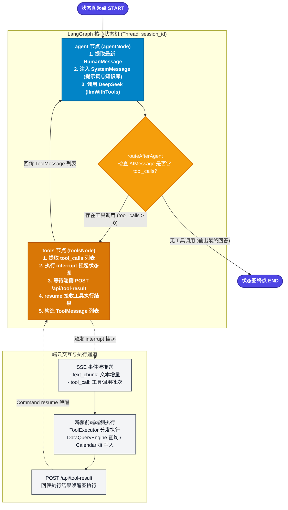
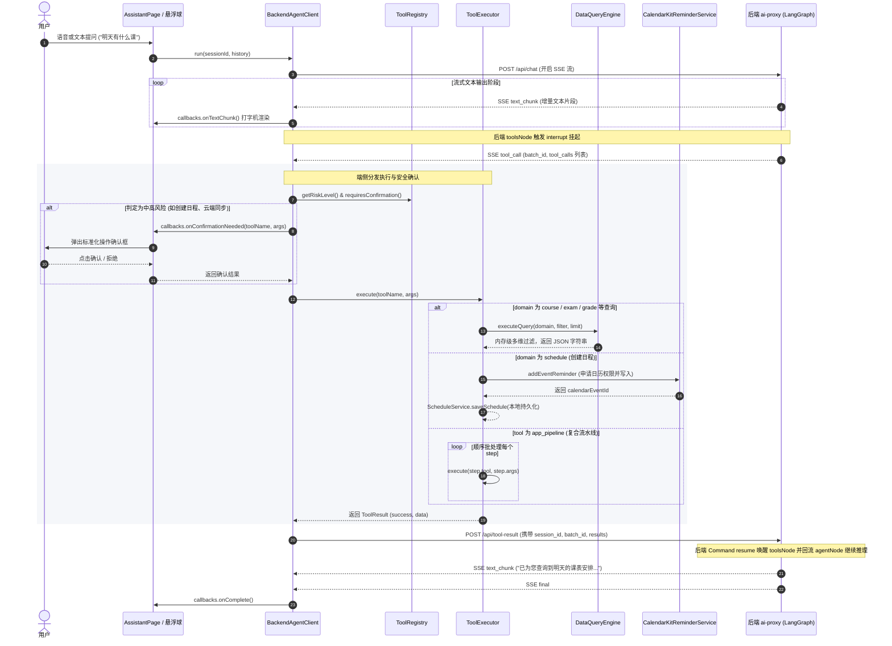

# AI 助手子系统技术规格与架构 (AI_AGENT.md)

> **架构模式**：后端 LangGraph.js 编排大脑 + 端侧 HarmonyOS NEXT 统一端侧控制引擎（Universal App Control Engine）。
> **端云交互**：基于 SSE 流式下行推送与中断挂起（Interrupt & Resume），结合端侧内存级多维查询、系统日历联动与 SubWindow 全局悬浮伴随。
> **快速上手指令**：见根目录 [`../AGENTS.md`](../AGENTS.md)。

---

## 1. 系统全景架构与端云协同

成电校园助手 AI 子系统采用 **「后端大脑 + 端侧统一控制引擎」** 架构：
- **后端（`ai-proxy`，独立仓库）**：负责 LangGraph 状态机编排、DeepSeek API 推理、系统提示词与成电 80+ 服务直达库 / 校园指南 RAG 注入、智谱 GLM-4V 视觉识别、教务处官网实时检索、SQLite 会话状态持久化。手机端仅发送最新增量消息（`{session_id, message}`），历史完全由后端检查点管理。
- **前端（HarmonyOS NEXT / ArkTS）**：作为薄客户端与端侧执行器，负责语音/文字/图片输入交互、SSE 数据流解析与打字机 Markdown 渲染、敏感操作安全确认弹窗、端侧数据纯内存多维查询（`DataQueryEngine`）、系统日历联动（`CalendarKit`）、页面路由与 UI 引导。

```
手机 (ArkTS / HarmonyOS NEXT)                 本地/云端 后端服务 (ai-proxy)
┌──────────────────────────────────────┐     SSE ↓     ┌──────────────────────────────┐
│ AssistantPage.ets / FloatingWindow   │──────────────▶│ Express + LangGraph.js       │
│  ├─ 原生 Markdown 渲染 (MarkdownBubble)│               │  ├─ POST /api/chat -> SSE 流  │
│  ├─ 链接拦截与内嵌浏览器 (WebPage)    │               │  ├─ POST /api/vision/parse.. │
│  ├─ 紧凑折叠工具面板 (Tool Collapse)   │               │  ├─ GET /api/knowledge/se.. │
│  ├─ 遥测指标卡片 (Telemetry Metrics)  │               │  ├─ StateGraph(Messages)      │
│  ├─ 语音输入 (CoreSpeechKit)         │               │  │   ├─ agentNode (DeepSeek)  │
│  ├─ 智谱 GLM-4V 海报/通知日程识别    │               │  │   └─ toolsNode (interrupt) │
│  ├─ 会话持久化 (ChatSessionRepository)│               │  ├─ SqliteSaver 检查点持久化  │
│  ├─ 页面感知 (PageContextTracker)    │               │  ├─ 智谱 GLM-4V (多模态视觉)  │
│  ├─ UI动作总线 (UIActionDispatcher)  │               │  ├─ CampusKnowledgeStore(RAG)│
│  ├─ 统一确认弹窗 (动态风险鉴权)       │               │  ├─ JWC 官网实时爬虫检索     │
│  └─ BackendAgentClient (SSE流式客户端)│    POST ↑     │  └─ DeepSeek API (推理核心)  │
│     ├─ ToolExecutor                  │──────────────▶│  └─ 80+ 校内直达服务库       │
│     │   ├─ DataQueryEngine (多维过滤) │               └──────────────────────────────┘
│     │   ├─ CalendarKit (双向同步去重)│
│     │   └─ Pipeline 复合批处理器     │
│     └─ 本地 Preferences / 日历读写   │
└──────────────────────────────────────┘
```

---

## 2. 后端 LangGraph 状态图与生命周期

### 2.1 状态机流转图 (Mermaid)



### 2.2 核心节点职责

| 节点名称 | 核心职责 | 输入与输出 |
| :--- | :--- | :--- |
| **`START`** | 接收外部触发输入，初始化当前 `thread_id` 状态。 | 输入：`{ messages: [HumanMessage] }` |
| **`agent`** | **推理大脑核心**：<br>1. 动态生成 `SystemMessage`（注入统一控制元工具规范、成电校园指南与服务直达库）；<br>2. 调用绑定了工具 Schema 的 LLM（`llmWithTools.invoke([sysMsg, ...msgs])`）；<br>3. 生成包含流式文本或 `tool_calls` 的 `AIMessage`。 | 输入：`MessagesAnnotation.State`<br>输出：`{ messages: [AIMessage] }`（注：`SystemMessage` 不存入持久化 State，避免膨胀） |
| **`tools`** | **端侧工具中断与恢复桥梁**：<br>1. 从上一条 `AIMessage` 中解析出 `tool_calls`；<br>2. 调用 LangGraph 原生 `interrupt({ toolCalls })` 挂起执行；<br>3. 恢复时接收前端回传的 `ToolResultInput[]`；<br>4. 将每个执行结果映射为 `ToolMessage`。 | 输入：`AIMessage.tool_calls`<br>中断输出：`{ toolCalls }`<br>恢复输入：`ToolResultInput[]`<br>节点输出：`{ messages: ToolMessage[] }` |
| **`END`** | 会话单轮推理完毕，SSE 向客户端发送 `type: 'final'` 并关闭流。 | 结束当前执行链 |

### 2.3 持久化与挂起恢复机制 (Interrupt & Resume)

1. **检查点存储**：`SqliteSaver.fromConnString('./checkpoints.sqlite')` 以 `thread_id: sessionId` 为主键持久化会话。
2. **挂起中断**：当 `toolsNode` 触发 `interrupt` 时，LangGraph 立即将图状态写入 SQLite 检查点并暂停当前任务。
3. **异步注册表**：后端在 `PendingToolRegistry` 中注册该会话的 Promise（带 30 秒超时控制）。
4. **恢复唤醒**：手机完成端侧执行后，`POST /api/tool-result` 携带 `batch_id` 和结果列表。后端调用 `registry.resolve()` 触发 `graph.stream(new Command({ resume: results }), config)`，直接从挂起点恢复图执行并无缝过渡回 `agent` 节点。

---

## 3. 前端端侧执行时序与生命周期

### 3.1 端侧执行时序图 (Mermaid)



---

## 4. 统一控制元工具体系（Universal App Control Engine）

前端将工具全面收敛为 **5 大核心元工具** 与 **4 大高阶辅助/页面感知工具**。元数据定义于 `ToolRegistry.ets`，执行逻辑实现在 `ToolExecutor.ets`。

### 4.1 5 大核心元工具

| 工具名称 | 风险等级 | 端侧确认 | 核心入参 (Schema) | 功能与执行逻辑 |
| :--- | :---: | :---: | :--- | :--- |
| **`app_data_query`** | `low` | ❌ 免确认 | • `domain`: `course` \| `exam` \| `grade` \| `schedule` \| `calendar` \| `reminder_setting` \| `system_info`<br>• `filter`: `date` (YYYY-MM-DD), `week` (1-20), `dayOfWeek` (1-7), `keyword`, `teacher`, `room`, `upcomingOnly`, `semesterId`, `minGpa`, `maxGpa`<br>• `limit`: 数量限制 | **统一数据智能查询器**：<br>由 `DataQueryEngine` 接管。纯内存级多维检索过滤，支持教学周/日期自动换算、GPA 实时计算、考试倒计时与系统日历读取。 |
| **`app_data_mutate`** | `medium` | ⚠️ 需确认 | • `domain`: `schedule` \| `calendar` \| `reminder_setting`<br>• `action`: `create` \| `update` \| `delete`<br>• `payload`: 变更对象数据<br>• `syncCalendar`: 是否同步写入系统日历（默认 `true`，具备唯一性查重）<br>• `remindMinutesBefore`: 提前提醒分钟数（默认 `30`） | **统一数据变更器**：<br>统一处理日程 CRUD、日历事件删除、提醒时间设置。联动 HarmonyOS `CalendarKit`，自动完成系统日历读写与权限申请。 |
| **`app_control`** | `high`<br>*(跳转为low)* | ⚠️ 需确认<br>*(跳转免确认)* | • `action`: `navigate` \| `sync_cloud` \| `download_cloud` \| `refresh_reminders`<br>• `params`: `{ page: string, syncScope?: 'all'\|'courses'\|'exams' }` | **统一应用系统控制**：<br>1. `navigate`: 页面平滑路由（课表/考试/成绩/设置/导入等 10 个主要页面）；<br>2. `sync_cloud`/`download_cloud`: 华为云数据库全量/增量同步与恢复；<br>3. `refresh_reminders`: 全量提醒与日历事件重建。 |
| **`campus_search`** | `low` | ❌ 免确认 | • `query`: 检索关键词或问题<br>• `source`: `guide` \| `jwc_news` \| `auto`<br>• `category`: `bus` \| `academic_policy` \| `hospital` \| `facilities` \| `service` \| `all` | **统一成电校园智搜**：<br>收录 `campus_services.json`（80+ 校内直达服务）、`campus_guide.json`（办事流程/校历/校医院）及教务处官网实时公告爬取。大模型识别服务意图时，直接输出标准 Markdown 链接 `[服务名称](URL)`。 |
| **`app_pipeline`** | `medium` | ⚠️ 需确认 | • `steps`: `[{ stepId: string, tool: string, args: object }]` | **声明式复合流水线批处理**：<br>一次下发多个有序原子动作（如“查空闲 ➔ 创日程 ➔ 写入日历”），在手机端顺序批处理，彻底规避多次网络往返延迟。 |

### 4.2 4 大高阶辅助与页面感知工具

1. **`get_current_page_context`**（Low 风险，免确认）：由 `PageContextTracker` 提供，感知用户当前停留在哪个页面（课表/考试/成绩/首页）及当前页面的数据快照与可用操作。
2. **`execute_page_action`**（Low 风险，免确认）：由 `UIActionDispatcher` 事件总线驱动，在当前页面直接触发 UI 动作（如切周 `switch_week`、切换 Tab 或展示聚光灯高亮引导 `show_guidance`）。
3. **`generate_study_plan`**（Low 风险，免确认）：分析用户即将到来的所有考试，根据倒计时剩余天数加权生成考前每日突击复习规划。
4. **`parse_text_to_schedule`**（Low 风险，免确认）：从讲座、比赛、作业等非结构化通知文本中提取时间、地点并格式化为日程入参。

### 4.3 向后兼容工具映射

为了保证旧版本或细粒度调用的兼容性，`ToolExecutor` 内部将传统原子工具自动委托给统一数据查询引擎与变更器：
- `query_today_courses` / `query_tomorrow_courses` / `query_week_courses` ➔ `queryEngine.executeQuery('course', ...)`
- `query_current_week` / `get_current_datetime` ➔ `queryEngine.executeQuery('system_info', ...)`
- `query_next_exam` / `query_all_exams` ➔ `queryEngine.executeQuery('exam', ...)`
- `query_grades` / `query_gpa` ➔ `queryEngine.executeQuery('grade', ...)`
- `create_schedule` / `update_schedule` / `delete_schedule` ➔ `executeDataMutate(...)`
- `sync_all_to_cloud` / `download_all_from_cloud` ➔ `executeAppControl(...)`

---

## 5. 前端核心子系统与 UI 交互特性

### 5.1 全局悬浮 AI 伴随助手（Floating Assistant）
- **SubWindow 独立子窗口架构 (`FloatingWindowManager.ets`)**：
  - 基于 HarmonyOS `windowStage.createSubWindow` 实现跨页面透明子窗口；
  - 严格生命周期管理：先调用 `setUIContent` 再配置尺寸与位置（规避 `1300002` 异常）。
- **双形态自由切换**：
  - **球态 (Ball Mode)**：60×60 vp 呼吸发光微型球，支持全屏自由拖拽与贴边吸附物理反馈；
  - **浮窗态 (Panel Mode)**：覆盖在当前页面之上的 Mini 助手卡片，右上角配备缩小 `[-]`、新对话 `[+]` 与关闭 `[X]`。
- **统一会话与历史管理 (`ChatSessionRepository.ets`)**：
  - 全屏助手与悬浮 Mini 助手共享同一套本地会话仓库，支持会话实时双向同步与独立新建。
- **状态同步与避让**：
  - 通过 `AppStorage` 实现悬浮球开关状态在全屏助手、应用设置页（`AppSettings.ets`）与浮窗本体之间的毫秒级双向同步；
  - 在全屏助手页自动避让隐藏，离开后自动恢复。

### 5.2 界面排版与 Markdown 渲染
- **原生 ArkTS Markdown 渲染引擎 (`MarkdownBubble.ets`)**：
  - 支持多级标题（# ~ ###）、粗体、行内代码、引用块、列表、代码块；
  - **原生超链接拦截与内嵌导航**：支持识别 Markdown 超链接 `[text](url)`，渲染为精致的蓝色链接胶囊按钮，点击自动拦截并推入 `WebPage.ets` 原生顶栏内嵌浏览器打开（保留返回、刷新、标题与线性进度条），不跳出 App；对于内部路由直接跳转本地对应页面。
  - **智能排版**：属性字段（`日期:`、`时间:`、`地点:`、`类型:`、`备注:`）自动换行，状态提示单独分段；全屏助手与悬浮 Mini 浮窗统一采用 `MarkdownBubble` 渲染。
- **紧凑折叠工具面板 (Tool Call Collapse UI)**：
  - 优雅的折叠行设计，支持状态指示、耗时与工具参数/结果一键展开查看。
- **Agent Telemetry 遥测指标**：
  - 在气泡底部展示流式耗时（ms）、Token 消耗估算与工具调用计数。

### 5.3 核心模块职责清单

| 前端模块文件 | 核心职责与关键方法 |
| :--- | :--- |
| `BackendAgentClient.ets` | SSE 流式长连接通信（`requestInStream`）、`TextDecoder` 分词解码、`tool_call` 中断响应与结果回传。 |
| `ToolRegistry.ets` | 工具元数据定义、参数校验与动态风险等级判定（`getRiskLevel` / `requiresConfirmation`）。 |
| `ToolExecutor.ets` | 端侧中央工具分发器（`switch(toolName)`）、CRUD 事务执行、流水线批处理（`executePipeline`）。 |
| `DataQueryEngine.ets` | 纯内存多维数据过滤与统一查询引擎（接管课表、考试、成绩、日程、日历）。 |
| `PageContextTracker.ets` | 全局页面活跃状态与数据快照感知中心（单例模式，`updateSnapshot`）。 |
| `UIActionDispatcher.ets` | 页面 UI 动作与高亮聚光灯指令总线（`switch_week` / `show_guidance`）。 |
| `FloatingWindowManager.ets` | HarmonyOS SubWindow 全局悬浮球与 Mini 浮窗生命周期管理。 |
| `CalendarKitReminderService.ets` | HarmonyOS 系统日历写入、班车/考试去重与事件查询。 |

---

## 6. 加新工具三处同步铁律（名称与参数必须完全一致）

每次新增或修改端侧工具时，必须且只能同步修改以下三处：

1. **后端 Schema 与元数据**：`ai-proxy/src/tools.ts`（定义 schema 与 `toolMeta`：`requiresConfirmation` / `riskLevel`）；
2. **前端执行器**：`ToolExecutor.ets`（`switch(toolName)` 分发执行具体逻辑）；
3. **前端注册表**：`ToolRegistry.ets`（定义镜像用于端侧动态风险评级与确认弹窗判定）。

---

## 7. 后端联调与独立验证

- **启动后端**：`cd "C:\Users\28399\Desktop\华为云\后端服务\ai-proxy" && npm run dev`（端口 3000）。后端 `.env`（`DEEPSEEK_API_KEY` 等）已 gitignore，勿提交。
- **单独模拟联调（不连手机）**：`node test/phone-sim.mjs` + `npm run typecheck`。
- **真机/模拟器联调**：填电脑 **局域网 LAN IP**（如 `http://192.168.1.11:3000`），不要填 `localhost`。
- **调试日志前缀**：`[BackendAgentClient]` / `[CalendarKit]` / `[ReminderDebug]` / `[ExamDebug]` / `[HomeDebug]` / `[FloatingWindow]`。
