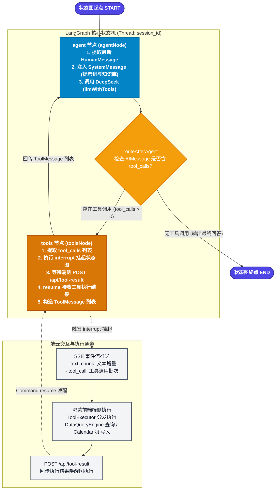
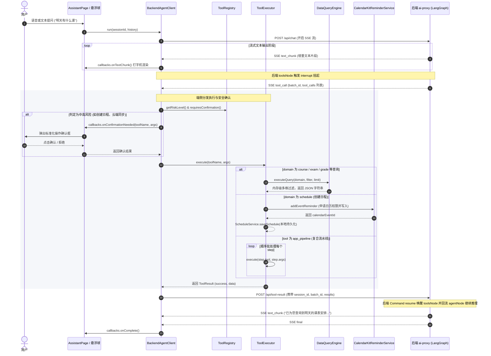

# 成电校园助手 AI 助手子系统技术架构与前端执行逻辑文档

> 本文档基于成电校园助手（UESTC Helper）项目，全面解析 **后端 LangGraph 编排大脑** 与 **前端 HarmonyOS NEXT 统一端侧控制引擎（Universal App Control Engine）** 的技术架构、状态机流转、工具体系及端云协同机制。

---

## 目录
1. [整体架构与交互协议](#1-整体架构与交互协议)
2. [后端 LangGraph 状态图与生命周期](#2-后端-langgraph-状态图与生命周期)
   - [Mermaid 状态节点图](#mermaid-状态节点图)
   - [节点（Nodes）详解](#节点nodes详解)
   - [边与条件路由（Edges & Routing）详解](#边与条件路由edges--routing详解)
   - [状态结构（State / MessagesAnnotation）详解](#状态结构state--messagesannotation详解)
   - [持久化与挂起恢复机制（Interrupt & Resume）](#持久化与挂起恢复机制interrupt--resume)
3. [前端 Agent Tool 体系架构](#3-前端-agent-tool-体系架构)
   - [5 大核心元工具（Universal Control Tools）](#5-大核心元工具universal-control-tools)
   - [4 大高阶辅助与页面感知工具](#4-大高阶辅助与页面感知工具)
   - [向后兼容工具映射](#向后兼容工具映射)
4. [前端端侧执行逻辑与子系统协同](#4-前端端侧执行逻辑与子系统协同)
   - [端侧执行时序图（Mermaid）](#端侧执行时序图mermaid)
   - [核心模块职责与代码映射](#核心模块职责与代码映射)
   - [动态风险控制与确认弹窗机制](#动态风险控制与确认弹窗机制)
   - [页面感知与 UI 动作分发（PageContext & UIAction）](#页面感知与-ui-动作分发pagecontext--uiaction)

---

## 1. 整体架构与交互协议

成电校园助手 AI 子系统采用 **「后端大脑 + 端侧执行引擎」** 架构：
- **后端（`ai-proxy`）**：负责 LangGraph 状态图编排、DeepSeek API 推理、系统提示词与知识库注入、智谱 GLM-4V 多模态视觉解析、教务处官网爬虫检索、SQLite 会话状态持久化。
- **前端（HarmonyOS NEXT / ArkTS）**：作为薄客户端与端侧执行器，负责语音/文字/图片输入交互、SSE 数据流解析与气泡渲染、敏感操作安全确认弹窗、端侧数据内存多维查询（`DataQueryEngine`）、系统日历联动（`CalendarKit`）、页面路由与 UI 引导。

```
┌──────────────────────────────────────────────────────────┐
│                   HarmonyOS 前端应用                      │
│                                                          │
│  ┌──────────────────────┐      ┌──────────────────────┐  │
│  │ AssistantPage (主页) │      │ FloatingWindow (悬浮)│  │
│  └──────────┬───────────┘      └──────────┬───────────┘  │
│             │                             │              │
│             └──────────────┬──────────────┘              │
│                            ▼                             │
│                  [BackendAgentClient]                    │
│                 (SSE 解码 / 事件分发)                     │
│                            │                             │
│       ┌────────────────────┴────────────────────┐        │
│       ▼                                         ▼        │
│  [ToolRegistry]                          [ToolExecutor]  │
│  (元数据 / 风险评级)                    (端侧工具分发执行)│
│                                                 │        │
│       ┌──────────────────┬──────────────────────┤        │
│       ▼                  ▼                      ▼        │
│ [DataQueryEngine] [CalendarKitService] [UIActionDispatcher│
│  (内存多维查询)    (系统日历/提醒联动)  (页面动作/聚光灯) │
└───────┬─────────────────────────────────────────▲────────┘
        │ 1. POST /api/chat (SSE 下行)            │ 3. POST /api/tool-result
        │    - text_chunk                         │    - session_id
        │    - tool_call                          │    - batch_id
        │    - final / error                      │    - results
        ▼                                         │
┌─────────────────────────────────────────────────┴────────┐
│                   本地/云端 后端服务 (ai-proxy)            │
│                                                          │
│  [Express HTTP / SSE Router] ── [PendingToolRegistry]   │
│                 │                        ▲               │
│                 ▼                        │               │
│        [LangGraph StateGraph] ───────────┘               │
│         ├─ agentNode (DeepSeek LLM + ToolBind)           │
│         ├─ toolsNode (interrupt 挂起 / resume 恢复)      │
│         └─ SqliteSaver (检查点持久化)                     │
│                 │                                        │
│         ├─ [CampusKnowledgeStore] (成电校园生活知识库)    │
│         ├─ [JWC Scraper] (教务处官网实时检索)            │
│         └─ [GLM-4V] (多模态海报与通知日程识别)            │
└──────────────────────────────────────────────────────────┘
```

---

## 2. 后端 LangGraph 状态图与生命周期

### Mermaid 状态节点图



---

### 节点（Nodes）详解

| 节点名称 | 对应实现函数 | 核心职责 | 输入与输出 |
| :--- | :--- | :--- | :--- |
| **`START`** | LangGraph 预置入口 | 接收外部触发输入，初始化当前 `thread_id` 状态。 | 输入：`{ messages: [HumanMessage] }` |
| **`agent`** | [`agentNode`](file:///c:/Users/28399/Desktop/华为云/后端服务/ai-proxy/src/graph.ts#L21-L34) | **推理大脑核心**：<br>1. 从 State 中回溯获取最新的 `HumanMessage` 文本；<br>2. 动态生成 `SystemMessage`（通过 `buildSystemPrompt` 注入统一控制元工具规范、成电校园指南知识）；<br>3. 调用绑定了工具 Schema 的 LLM（`llmWithTools.invoke([sysMsg, ...msgs])`）；<br>4. 生成包含流式思考/文本或 `tool_calls` 的 `AIMessage`。 | 输入：`MessagesAnnotation.State`<br>输出：`{ messages: [AIMessage] }`（注：`SystemMessage` 不存入持久化 State，避免膨胀） |
| **`tools`** | [`toolsNode`](file:///c:/Users/28399/Desktop/华为云/后端服务/ai-proxy/src/graph.ts#L41-L53) | **端侧工具中断与恢复桥梁**：<br>1. 从上一条 `AIMessage` 中解析出 `tool_calls`；<br>2. 调用 LangGraph 原生 `interrupt({ toolCalls })` 挂起执行；<br>3. 恢复时接收前端回传的 `ToolResultInput[]`；<br>4. 将每个执行结果映射为 `ToolMessage`（格式：`success ? data : "错误: " + data`）。 | 输入：`AIMessage.tool_calls`<br>中断输出：`{ toolCalls }`<br>恢复输入：`ToolResultInput[]`<br>节点输出：`{ messages: ToolMessage[] }` |
| **`END`** | LangGraph 预置出口 | 会话单轮推理完毕，SSE 向客户端发送 `type: 'final'` 并关闭流。 | 结束当前执行链 |

---

### 边与条件路由（Edges & Routing）详解

1. **起始静态边**：`START ➔ agent`
   - 请求到达后，无条件首先进入 `agent` 节点执行 LLM 推理。
2. **条件分支边**：`agent ➔ routeAfterAgent`
   - **实现**：[`routeAfterAgent(state)`](file:///c:/Users/28399/Desktop/华为云/后端服务/ai-proxy/src/graph.ts#L55-L59)
   - **路由判断逻辑**：
     - 若最后一条消息为 `AIMessage` 且其 `tool_calls` 包含至少 1 个待调用工具，路由目标为 **`'tools'`**；
     - 若无 `tool_calls`（即 LLM 已得出最终自然语言答复），路由目标为 **`END`**。
3. **回流静态边**：`tools ➔ agent`
   - 端侧工具执行完毕并生成 `ToolMessage[]` 后，无条件回流至 `agent` 节点，使 LLM 能基于工具返回的数据继续下一步推理或给出最终解答。

---

### 状态结构（State / MessagesAnnotation）详解

后端使用 LangGraph 的标准 `MessagesAnnotation`：

```typescript
// 状态定义：基于 BaseMessage 数组，天然具备 Reducer 机制（自动追加新消息）
state: {
  messages: BaseMessage[]
}
```

#### 消息流转时序中的消息类型变化：
1. **用户提问**：`[HumanMessage("查一下明天有什么课")]`
2. **Agent 节点产出工具调用**：`[HumanMessage, AIMessage(content="", tool_calls=[{id: "call_01", name: "app_data_query", args: {domain: "course", filter: {date: "2026-08-22"}} }])]`
3. **Tools 节点产出工具结果**：`[HumanMessage, AIMessage(tool_calls), ToolMessage(tool_call_id="call_01", content='{"domain":"course","count":2,"items":[...]}')]`
4. **Agent 节点给出最终回答**：`[HumanMessage, AIMessage(tool_calls), ToolMessage, AIMessage(content="你明天共有 2 节课：第1-2节 高等数学，第3-4节 大学物理。")]`

---

### 持久化与挂起恢复机制（Interrupt & Resume）

1. **检查点存储**：[`checkpointer = SqliteSaver.fromConnString('./checkpoints.sqlite')`](file:///c:/Users/28399/Desktop/华为云/后端服务/ai-proxy/src/graph.ts#L61-L63)，以 `thread_id: sessionId` 为主键，完整的执行图状态与历史消息保存在本地数据库中。
2. **挂起中断**：当 `toolsNode` 触发 `interrupt` 时，LangGraph 立即将图状态写入 SQLite 检查点并暂停当前任务。
3. **异步注册表**：后端在 [`PendingToolRegistry`](file:///c:/Users/28399/Desktop/华为云/后端服务/ai-proxy/src/registry.ts#L15) 中注册该会话的 Promise（带 30 秒超时控制）。
4. **恢复唤醒**：手机完成端侧执行后，`POST /api/tool-result` 携带 `batch_id` 和结果列表。后端调用 `registry.resolve()` 触发，并执行：
   ```typescript
   graph.stream(new Command({ resume: results }), config)
   ```
   直接从挂起点恢复图执行，无缝过渡回 `agent` 节点。

---

## 3. 前端 Agent Tool 体系架构

前端统一将过去分散的 30 多个工具收敛为 **5 大核心元工具**（Universal App Control Engine）与 **4 大高阶辅助/页面感知工具**。元数据定义于 [`ToolRegistry.ets`](file:///d:/harmony/helper_app/Application/entry/src/main/ets/common/agent/ToolRegistry.ets)，执行逻辑实现在 [`ToolExecutor.ets`](file:///d:/harmony/helper_app/Application/entry/src/main/ets/common/agent/ToolExecutor.ets)。

### 5 大核心元工具（Universal Control Tools）

| 工具名称 | 风险等级 | 端侧确认 | 核心入参 (Schema) | 功能与执行逻辑 |
| :--- | :---: | :---: | :--- | :--- |
| **`app_data_query`** | `low` | ❌ 免确认 | • `domain`: `course` \| `exam` \| `grade` \| `schedule` \| `calendar` \| `reminder_setting` \| `system_info`<br>• `filter`: `date`, `week`, `dayOfWeek`, `keyword`, `teacher`, `room`, `upcomingOnly`, `minGpa`, `maxGpa` 等<br>• `limit`: 数量限制 | **统一数据智能查询器**：<br>由 [`DataQueryEngine`](file:///d:/harmony/helper_app/Application/entry/src/main/ets/common/agent/DataQueryEngine.ets) 接管。纯内存级多维检索过滤，支持教学周/日期自动换算、GPA 实时计算、考试倒计时与系统日历读取。 |
| **`app_data_mutate`** | `medium` | ⚠️ 需确认 | • `domain`: `schedule` \| `calendar` \| `reminder_setting`<br>• `action`: `create` \| `update` \| `delete`<br>• `payload`: 变更对象数据<br>• `syncCalendar`: 是否同步写入系统日历（默认 `true`）<br>• `remindMinutesBefore`: 提前提醒分钟数（默认 `30`） | **统一数据变更器**：<br>统一处理日程增删改、日历事件删除、提醒时间设置。联动 HarmonyOS `CalendarKit`，自动完成系统日历读写与权限申请。 |
| **`app_control`** | `high`<br>*(页面跳转为low)* | ⚠️ 需确认<br>*(跳转免确认)* | • `action`: `navigate` \| `sync_cloud` \| `download_cloud` \| `refresh_reminders`<br>• `params`: `{ page: string, syncScope?: string }` | **统一应用系统控制**：<br>1. `navigate`: 页面平滑路由（课表/考试/成绩/设置/导入等 10 个页面）；<br>2. `sync_cloud`/`download_cloud`: 华为云数据库全量/增量同步与恢复；<br>3. `refresh_reminders`: 全量提醒与日历事件重建。 |
| **`campus_search`** | `low` | ❌ 免确认 | • `query`: 检索关键词或问题<br>• `source`: `guide` \| `jwc_news` \| `auto`<br>• `category`: `bus` \| `academic_policy` \| `hospital` \| `facilities` \| `all` | **统一成电校园智搜**：<br>本地离线校园指南（校车时刻、校医院、缓考补考规定、保研推免绩点、自习室场馆）与线上成电教务处（`eams.uestc.edu.cn`）官网实时公告抓取。 |
| **`app_pipeline`** | `medium` | ⚠️ 需确认 | • `steps`: `[{ stepId: string, tool: string, args: object }]` | **声明式复合流水线批处理**：<br>一次下发多个有序原子动作（如“查空闲 ➔ 创日程 ➔ 写入日历”），在手机端顺序批处理，彻底规避多次网络往返延迟。 |

---

### 4 大高阶辅助与页面感知工具

1. **`generate_study_plan`**（Low 风险）：分析用户即将到来的所有考试，根据倒计时剩余天数加权生成考前每日突击复习规划。
2. **`parse_text_to_schedule`**（Low 风险）：从讲座、比赛、作业等非结构化通知文本中提取时间、地点并格式化为日程入参。
3. **`get_current_page_context`**（Low 风险）：由 [`PageContextTracker`](file:///d:/harmony/helper_app/Application/entry/src/main/ets/common/agent/PageContextTracker.ets) 提供，感知用户当前停留在哪个页面（课表/考试/成绩/首页）及当前页面的数据快照与可用操作。
4. **`execute_page_action`**（Low 风险）：由 [`UIActionDispatcher`](file:///d:/harmony/helper_app/Application/entry/src/main/ets/common/agent/UIActionDispatcher.ets) 事件总线驱动，在当前页面直接触发 UI 动作（如切周 `switch_week`、切换 Tab 或展示聚光灯高亮引导 `show_guidance`）。

---

### 向后兼容工具映射

为了保证旧版本或细粒度调用的兼容性，`ToolExecutor` 内部将 20+ 个传统原子工具通过内部适配函数自动委托给统一数据查询引擎与变更器：
- `query_today_courses` / `query_tomorrow_courses` / `query_week_courses` ➔ `queryEngine.executeQuery('course', ...)`
- `query_current_week` / `get_current_datetime` ➔ `queryEngine.executeQuery('system_info', ...)`
- `query_next_exam` / `query_all_exams` ➔ `queryEngine.executeQuery('exam', ...)`
- `query_grades` / `query_gpa` ➔ `queryEngine.executeQuery('grade', ...)`
- `create_schedule` / `update_schedule` / `delete_schedule` ➔ `executeDataMutate(...)`
- `sync_all_to_cloud` / `download_all_from_cloud` ➔ `executeAppControl(...)`

---

## 4. 前端端侧执行逻辑与子系统协同

### 端侧执行时序图（Mermaid）



---

### 核心模块职责与代码映射

| 前端模块文件 | 核心职责与关键方法 |
| :--- | :--- |
| [`BackendAgentClient.ets`](file:///d:/harmony/helper_app/Application/entry/src/main/ets/common/agent/BackendAgentClient.ets) | • **流式网络通信**：封装 `@kit.NetworkKit` 的 `requestInStream`。<br>• **SSE 协议解析器**：通过 `util.TextDecoder` 与缓冲区切分 `\n\n` 处理增量数据。<br>• **异步调度**：处理 `text_chunk`、`tool_call`、`final`、`error` 四类协议事件；在触发工具调用后自动发起 `POST /api/tool-result`。 |
| [`ToolRegistry.ets`](file:///d:/harmony/helper_app/Application/entry/src/main/ets/common/agent/ToolRegistry.ets) | • **工具元数据仓库**：定义所有工具的参数类型、描述与必填项。<br>• **动态风险鉴权**：[`getRiskLevel(name, argsStr)`](file:///d:/harmony/helper_app/Application/entry/src/main/ets/common/agent/ToolRegistry.ets#L262-L275) 和 [`requiresConfirmation(name, argsStr)`](file:///d:/harmony/helper_app/Application/entry/src/main/ets/common/agent/ToolRegistry.ets#L247-L260)，针对特例（如 `app_control` 中的页面跳转 `navigate`）动态降级为 Low 风险免弹窗。 |
| [`ToolExecutor.ets`](file:///d:/harmony/helper_app/Application/entry/src/main/ets/common/agent/ToolExecutor.ets) | • **中央执行分发器**：`switch(toolName)` 分发执行具体逻辑。<br>• **CRUD 事务闭环**：在 `executeDataMutate` 中维护日程本地持久化 + CalendarKit 系统日历写入的一致性。<br>• **复合流水线执行**：[`executePipeline`](file:///d:/harmony/helper_app/Application/entry/src/main/ets/common/agent/ToolExecutor.ets#L440-L478) 顺序批处理步骤，支持步骤间短路中断。 |
| [`DataQueryEngine.ets`](file:///d:/harmony/helper_app/Application/entry/src/main/ets/common/agent/DataQueryEngine.ets) | • **统一内存数据多维查询引擎**：统一接管 `CourseService`、`ExamService`、`GradeService`、`ScheduleService`、`ReminderService`。<br>• **多维过滤**：实现日期/教学周转换、周几换算、关键词/教师/教室过滤、GPA 区间筛选、即将到来考试/日程过滤。 |
| [`PageContextTracker.ets`](file:///d:/harmony/helper_app/Application/entry/src/main/ets/common/agent/PageContextTracker.ets) | • **全局页面感知中心**：单例模式，各页面在 `onPageShow` / 数据变化时调用 `updateSnapshot` 上报当前页面名称、标题、数据概要及可操作动作。 |
| [`UIActionDispatcher.ets`](file:///d:/harmony/helper_app/Application/entry/src/main/ets/common/agent/UIActionDispatcher.ets) | • **UI 指令事件总线**：注册/分发 UI 交互动作（如 `switch_week` 切换课表周次，`show_guidance` 触发聚光灯高亮引导遮罩）。 |
| [`FloatingWindowManager.ets`](file:///d:/harmony/helper_app/Application/entry/src/main/ets/common/agent/FloatingWindowManager.ets) | • **系统级悬浮伴随助手**：基于 HarmonyOS `SubWindow` 创建独立透明子窗口，支持全局悬浮球（边缘智能吸附）与浮窗模式自由切换。 |
