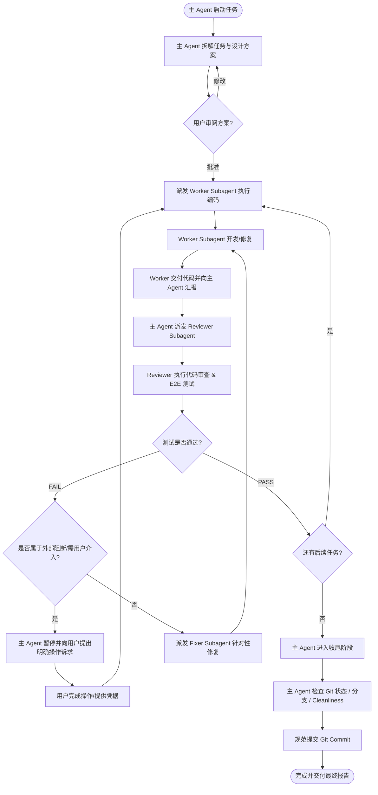

# Helper App（Web / PWA）多 Agent 协同开发与任务编排规范

> **规范版本**：v1.0.0 (Production Edition)  
> **生效工程**：`C:\Users\28399\Desktop\web`（前端 Web/PWA）、`C:\Users\28399\Desktop\华为云\后端服务\ai-proxy`（后端服务）  
> **制定目的**：规范多 Agent 协同分工、流水线闭环测试、异常降级与最终 Git 管理收尾标准，确保真实功能修复的高可靠性与零劣质代码合并。

---

## 一、Agent 角色职责与分工矩阵

在多 Agent 协同开发模式中，**主 Agent（Main Agent）** 承担“架构总指挥与质量守门人”角色，**子 Agent（Subagent）** 承担“单一职责执行人”角色。

```
                       ┌───────────────────────────────┐
                       │          主 Agent             │
                       │ (任务拆解 / 派发 / 决策 / 收尾) │
                       └───────┬───────────────▲───────┘
                               │ 派发任务       │ 报告结果与复核
               ┌───────────────▼──────┐ ┌──────┴──────────────┐
               │    Worker Subagent   │ │ Reviewer & Tester   │
               │ (功能开发 / Bug修复) │ │  (独立Review / E2E)  │
               └───────────────┬──────┘ └──────▲──────────────┘
                               │ 交付代码产物   │ 触发测试
                               └───────────────┘
```

### 1. 主 Agent（Main Agent / 编排与收尾总控）
- **核心职责**：
  1. **任务全局规划与分解**：负责阅读架构规范、需求文档及缺陷报告，将复杂功能拆解为高内聚、低耦合的原子任务卡片（Task Cards）；
  2. **Subagent 调度与上下文注入**：按需派出专属 Worker Subagent，提供明确的目标、输入文件、修改边界与预期验收指标；
  3. **质量闭环驱动（Loop Orchestration）**：当 Worker Subagent 完成修复后，自动派出独立的 Reviewer/Tester Subagent 进行代码 Review 和真实测试；
  4. **测试失败决策分流**：
     - 若测试失败：分析失败日志，派出 Fixer Subagent 继续针对性修复，直至测试全通；
     - 若遇到无法自主突破的外部阻碍（如学校 CAS 验证码真机人机拦截、缺少云端鉴权密钥、需要真实用户账号授权等）：**立即主动中断并向用户汇报请求协助**，严禁死循环；
  5. **最终收尾质量门禁（Final Closure & Quality Gate）**：统一执行 Git 状态审查、代码编译静态检查、测试套件全量回归、无死代码/错误代码 Merge 确认，提交语义化 Git Commit。

### 2. Worker Subagent（开发 / 修复执行者，如 Subagent-1, Subagent-3）
- **核心职责**：
  1. 严格在指定的代码边界内进行真实实现（**坚决杜绝使用 Mock / `setTimeout` 假数据伪造功能**）；
  2. 保持代码风格与既有工程（TypeScript + React + Tailwind CSS / Node.js Express）高度一致；
  3. 输出清晰的修改清单（File Diff）、设计决策与自测日志，向主 Agent 汇报并移交待审阅产物。

### 3. Reviewer & Tester Subagent（代码审阅与测试执行者，如 Subagent-2, Subagent-4）
- **核心职责**：
  1. **代码安全与质量审阅（Code Review）**：
     - 检查是否残留 Mock、硬编码凭据、未捕获的 Promise 异常；
     - 检查类型定义是否严谨（`tsc -b` 0 error），状态管理与存储读写是否闭环；
  2. **自动化与端到端测试（Testing & Verification）**：
     - 运行 `npm run build` 验证打包产物；
     - 运行 `npm run test:e2e`（或 `node scripts/e2e-test.mjs`，基于本地无头 Edge 浏览器）执行真实 UI 交互与数据流转断言；
     - 测试后端接口（`curl` / API 测试脚本）验证 HTTP 状态码与 Payload 契约；
  3. **判定与交付**：给出明确的 **`PASS`** 或 **`FAIL`** 结论，附带错误堆栈、失败步骤与修复建议。

---

## 二、多 Agent 闭环执行流水线（SOP）



---

## 三、异常处理与用户介入（Escalation Protocol）

当且仅当发生以下情况时，主 Agent 应立即暂停自动化流水线，输出清晰的问询或操作指引请求用户协助：

| 触发场景 | 原因说明 | 主 Agent 应对动作 |
|---|---|---|
| **成电 CAS 出现图片验证码 / 动态滑动拼图** | 浏览器与爬虫无法自动化穿透反爬虫防护 | 提示用户提供 Cookie 或在内嵌弹窗/代理模式下完成一次授权 |
| **华为 AGC 跨域 CORS 或缺少应用公私钥** | 需要在华为开发者联盟后台配置跨域白名单或生成 API 凭据 | 给出明确的 AGC 控制台配置步骤，等待用户确认 |
| **测试连续修复超过 3 轮未收敛** | 出现深层次架构冲突或环境异常 | 汇报当前根因排查日志与 2 种备选解决方案，由用户拍板决策 |

---

## 四、最终收尾质量门禁标准（Final Closure Quality Gate）

在主 Agent 宣布任务完成并交付前，**必须 100% 逐项通过以下自检清单**：

### 1. 代码质量与类型安全（Code Quality）
- [ ] 前端运行 `npm run build`（`tsc -b && vite build`）通过，**0 Error, 0 Warning**；
- [ ] 后端（`ai-proxy`）运行 `npm run typecheck` 通过，**0 Error**；
- [ ] **彻底消除伪造数据 Mock**：生产逻辑中不存在假 `setTimeout` 延迟伪装的“成功”，所有数据拉取均走通真实网络调用或明确的优雅降级。

### 2. 端到端与功能回归测试（E2E & Functional Testing）
- [ ] 运行 `npm run test:e2e`（或 `node scripts/e2e-test.mjs`），所有 E2E 用例测试通过（**100% PASS**）；
- [ ] 测试产物截图正常生成并归档，无布局错乱或空白异常。

### 3. Git 版本控制与分支规范（Git Hygiene & Management）
- [ ] **工作区干净度检查**：执行 `git status`，确认无无意义的未追踪临时文件（除规范内的 `.env` / `temp/` 等被 `.gitignore` 保护的外）；
- [ ] **提交原子性与语义化**：按 Angular Commit 规范执行提交，提交信息格式：  
  `feat(sync): implement real JWC CAS and Huawei AGC cloud database sync`  
  `fix(jwc): handle webvpn session recovery and semester dynamic query`
- [ ] **代码完整性验证**：检查 `git diff`，确认没有被遗漏的断点调试代码（`console.log` 残留）、没有半途而废的错误代码混入。

---

## 五、文档与变更记录同步要求
- 任务执行完毕后，主 Agent 必须同步更新：
  1. [`doc/ARCHITECTURE.md`](./ARCHITECTURE.md) 与 [`doc/API_INTERFACE.md`](./API_INTERFACE.md)（若架构或接口契约有更新）；
  2. [`doc/BUILD_AND_TEST.md`](./BUILD_AND_TEST.md)（若运维脚本或构建流程有变化）；
  3. 生成或更新测试验收报告。
