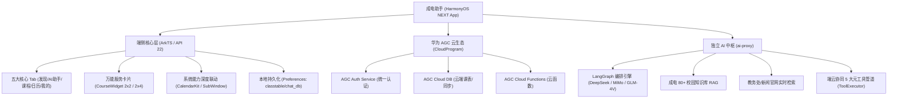
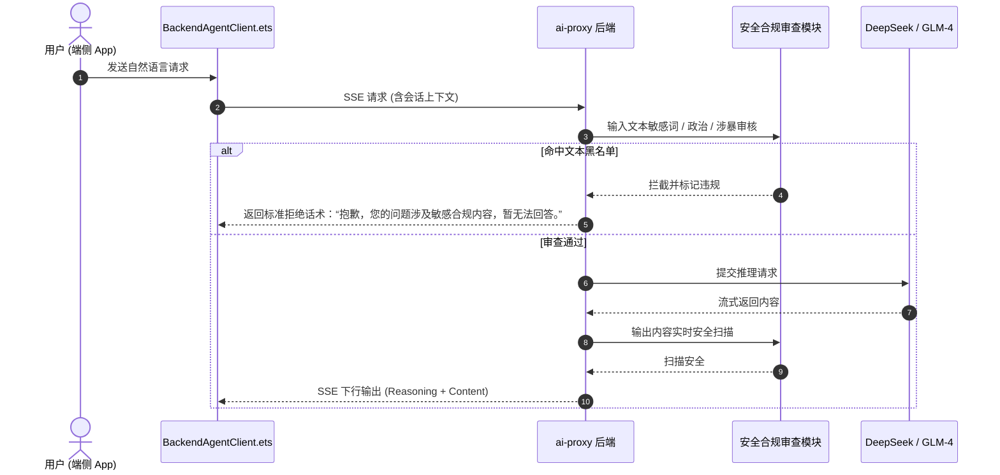
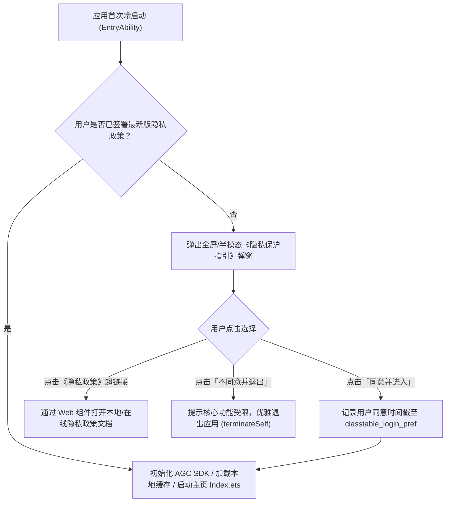

# 电子科技大学成电助手（Helper App）
## 华为应用市场（AppGallery Connect）上架全景调查与实操规范报告

> **文档归档路径**：`D:\harmony\helper_app\doc\AGC_RELEASE_GUIDE.md`  
> **适用平台**：HarmonyOS NEXT (API 12 / 6.0.2 / API 22)  
> **涉及系统**：端侧 ArkTS 应用 + AGC 云服务 (Auth / Cloud DB / Cloud Functions) + `ai-proxy` AI 助手后端服务  
> **报告编制日期**：2026-08-27  

---

## 目录

1. [项目架构与上架特征剖析](#1-项目架构与上架特征剖析)
2. [上架准入前置资质与法律合规要件](#2-上架准入前置资质与法律合规要件)
3. [大模型（AI伴学助手）专项合规要求](#3-大模型ai伴学助手专项合规要求)
4. [教务与校园数据安全合规改造](#4-教务与校园数据安全合规改造)
5. [隐私政策与用户权益合规体系](#5-隐私政策与用户权益合规体系)
6. [HarmonyOS NEXT 工程配置与签名打包](#6-harmonyos-next-工程配置与签名打包)
7. [AGC 平台提审材料与实操配置](#7-agc-平台提审材料与实操配置)
8. [审核避坑指南与高频被拒要点应对](#8-审核避坑指南与高频被拒要点应对)
9. [上架全流程推进时间表与任务检查清单 (Checklist)](#9-上架全流程推进时间表与任务检查清单-checklist)

---

## 1. 项目架构与上架特征剖析

### 1.1 项目全景与技术栈画像

本项目是专为电子科技大学（UESTC）师生打造的**一站式智慧校园生活与 AI 伴学助手原生鸿蒙应用**，基于 HarmonyOS NEXT 纯血鸿蒙体系开发，深度融合了华为终端生态与云端能力：



### 1.2 上架 AGC 涉及的四大敏感属性判定

在华为应用市场（AppGallery Connect, 简称 AGC）的分类审核体系中，本项目具有典型的**复合特征**，属于审核规则重点覆盖的高敏感应用类别：

| 特征维度 | 项目具体模块 | 华为 AGC 审核重点判定 |
|---|---|---|
| **校园与高校类工具** | 课表解析、成绩查询、考试日程、校车时刻、统一身份认证 (CAS/IDAS/VPN) | 严禁假冒学校官方名义，需明确声明为第三方辅助工具；涉及爬虫抓取校园内网需保障凭证安全。 |
| **生成式 AI / 大模型** | AI 助手伴学、自然语言查询日程、校园动态问答、DeepSeek/MiMo/GLM 推理 | 必须具备**算法备案/大模型上线备案**标识、敏感词违规拦截、一键举报机制、深度合成内容显著标识。 |
| **系统深度受限权限** | CalendarKit 系统日历写入、后台提醒代理、桌面卡片刷新、SubWindow 全局悬浮窗 | 必须提供清晰合规的权限申请理由（`reason`），遵循“最小必要原则”，严禁未经授权静默获取。 |
| **云端与第三方服务** | 华为 AGC Auth/Cloud DB、外部自建 `ai-proxy` 后端、大模型第三方供应商 | 隐私协议必须详尽披露第三方 SDK 清单与数据传输路径，提供完整的账号注销与数据删除链路。 |

---

## 2. 上架准入前置资质与法律合规要件

在向 AGC 提交应用前，必须完成以下**国家法定前置审批与开发者资质认证**：

### 2.1 开发者账号类型与主体要求

- **推荐资质：企业/高校组织开发者认证**
  - **原因**：个人开发者在华为应用市场提交包含**校园教务系统对接**及**生成式 AI 对话**功能的应用时，极易因“个人开发者无法提供教育/大模型安全资质”被直接驳回。
  - **办理材料**：企业营业执照 / 事业单位法人证书 / 高校社团或实验室挂靠企业主体、法人身份证件、统一社会信用代码、对公账户打款验证。
- **若以个人开发者身份提审的限制方案**：
  - 必须在应用名称、启动页、设置页显著标注“**个人开发者/第三方非官方工具**”；
  - 软著申请人须与开发者实名认证一致；
  - 部分大模型高级特性可能受限，需提供完备的安全过滤机制承诺函。

### 2.2 必须具备的三大证件与备案编号

```
┌────────────────────────────────────────────────────────────────────────┐
│                        AGC 上架法定三件套 (必填项)                       │
├──────────────────┬───────────────────────────────┬─────────────────────┤
│ 1. 软件著作权    │ 《计算机软件著作权登记证书》    │ 名称需与 App 名称一 │
│    登记证书      │ (软著 / 电子版权认证证书 DCI)  │ 致（如“成电助手”）   │
├──────────────────┼───────────────────────────────┼─────────────────────┤
│ 2. 工信部 App    │ 移动互联网应用程序 (App) 备案  │ 在华为云或接入服务  │
│    备案号        │ (如：川ICP备xxxxxxx号-1X)     │ 商处完成 App 备案   │
├──────────────────┼───────────────────────────────┼─────────────────────┤
│ 3. 算法/大模型   │ 生成式人工智能服务上线备案 /   │ 声明调用的大模型备  │
│    备案公示      │ 深度合成算法服务备案编号      │ 案号（如DeepSeek等）│
└──────────────────┴───────────────────────────────┴─────────────────────┤
```

#### 关键步骤：App 备案（工信部强制要求）
1. 在 AGC 创建应用并获取 `Package Name`（包名，如 `com.uestc.helper`）及公钥指纹（SHA-256 签名证书指纹）；
2. 登录**华为云 ICP 备案系统**或域名托管服务商后台，选择“App 备案”；
3. 填报 App 名称、图标、包名、公钥 SHA-256、域名白名单（包括教务系统代理域名、`ai-proxy` 域名）；
4. 获得通信管理局核发的 App 备案号（如 `川ICP备xxxxxxxx号-1A`），上架时 AGC 系统会自动校验。

---

## 3. 大模型（AI 伴学助手）专项合规要求

本项目内置了基于 LangGraph 编排的多模型 AI 伴学助手，直连 DeepSeek、小米 MiMo、智谱 GLM-4V。根据《生成式人工智能服务管理暂行办法》及华为应用市场《AI 类应用审核规范》，必须实施以下改造：

### 3.1 大模型合规备案信息公示

在应用内的“**AI 助手设置页**”及“**关于页面**”中，必须展示大模型技术提供方的算法备案信息：

```json
{
  "compliance_statement": {
    "feature": "成电助手 AI 伴学中枢",
    "provider_models": [
      {
        "name": "DeepSeek-V3 / R1",
        "provider": "杭州深度求索人工智能基础技术研究有限公司",
        "service_record_no": "网信算备330108xxxxxxxx号"
      },
      {
        "name": "智谱 GLM-4",
        "provider": "北京智谱华章科技有限公司",
        "service_record_no": "网信算备110108xxxxxxxx号"
      }
    ],
    "statement": "本应用 AI 伴学对话功能由已完成网信办生成式人工智能服务备案的大模型提供底层算法支持，生成的所有内容均由算法合成。"
  }
}
```

### 3.2 深度合成内容显著标识（水印与防伪）

- **气泡标识**：AI 生成的每条回复气泡底部，必须标明“**由 AI 模型生成，内容仅供参考，请核实关键信息**”；
- **Markdown 渲染拦截**：在 `MarkdownBubble.ets` 中，生成的日程或建议不得误导用户为教务官方行政决定。

### 3.3 敏感词过滤与违规内容拦截机制

在 `ai-proxy` 后端与端侧 `ToolExecutor` 之间建立**双向安全过滤网**：



### 3.4 用户一键投诉与内容反馈入口

在每个 AI 回复消息气泡旁增加操作项：
1. **点赞 / 点踩**；
2. **“违规内容举报”按钮**：点击后弹出对话框，包含（涉黄涉暴/政治敏感/错误虚假/泄露隐私）选项，点击后上报后端并记录日志。**此项为 AGC AI 类应用审核的硬性要求，缺失必被驳回**。

---

## 4. 教务与校园数据安全合规改造

教务系统涉及学生的学籍、成绩、身份证号等高敏感数据，华为审核团队对此类“爬取校园内网”应用审查极为严格：

### 4.1 命名与版权合规（去官方化）

- **应用名称规范**：
  - ❌ 禁止：`电子科技大学`、`电子科技大学官方教务`、`成电教务处`（会被认定为无授权假冒高校官方）；
  - ✅ 推荐：`成电助手`、`成电小助手 - 智慧校园生活工具`、`成电课表伴侣`。
- **免责声明（首次登录弹窗与关于页必须常驻）**：
  > “本应用由个人/团队独立开发，属于第三方辅助工具，非电子科技大学官方发布。本软件不保存您的统一身份认证（CAS/IDAS）明文密码，所有教务数据仅在您授权下用于本地课表与成绩解析展示。”

### 4.2 登录凭证安全与加密存储规范

- **密码禁止云端持久化**：
  - 用户的学号与登录密码**严禁上传至 `ai-proxy` 或 AGC Cloud DB 数据库**；
  - 密码必须仅保存在端侧安全首选项 `classtable_login_pref`，并采用平台标准加密套件保护；
  - 抓取会话建立完成后，仅保留 Session Cookie / Token 用于后续刷新。
- **HTTPS 全量加密传输**：
  - 所有涉及教务内网与 VPN 代理的通信（`VpnEncoder`），必须强制校验 TLS 证书，禁止允许任意非法自签名证书（`module.json5` 的 `network-security-config` 不得设为全通）。

---

## 5. 隐私政策与用户权益合规体系

### 5.1 首次启动“隐私协议”交互规范

华为 AGC 对隐私合规实行“一票否决制”。必须确保：
1. **未同意不调用**：在用户点击“同意并继续”之前，**严禁初始化任何网络 SDK、严禁获取设备 UDID/OAID、严禁访问系统日历、严禁发起任何网络请求**；
2. **双按钮平等呈现**：弹窗必须提供“同意”与“暂不同意/退出”两个对等选项；
3. **直达文本链接**：弹窗内必须包含可点击打开的《用户服务协议》与《隐私政策》跳转链接。



### 5.2 权限最小化与声明清单（`module.json5` 审查）

本项目涉及的核心权限及其在 AGC 提审时的合规理由对照表：

| 权限标识 (Permission) | 授权方式 | 核心业务用途 | `reason` 规范文案（国际化 resources） |
|---|---|---|---|
| `ohos.permission.INTERNET` | system_grant | 访问教务网同步课表、连接 AI 伴学服务及 AGC 云数据库 | 用于向教务系统同步课表日程及与 AI 助手进行智能对话 |
| `ohos.permission.READ_CALENDAR` | user_grant | 读取系统日历已有排程，防止课程/校车提醒冲突 | 用于查看系统日历事件以智能规划您的校园日程安排 |
| `ohos.permission.WRITE_CALENDAR` | user_grant | 将课程、考试倒计时、校车时刻一键写入系统日历 | 用于将您的课程表、考试日程和校车提醒自动添加至系统日历 |
| `ohos.permission.PUBLISH_AGENT_REMINDER` | system_grant | 桌面服务卡片与后台上课提醒通知 | 用于在上课前 15 分钟为您发送及时的上课与校车发车提醒 |

> [!IMPORTANT]
> **受限权限（ACL）审查**：如果应用在 `module.json5` 中申请了高等级受限权限（如 `ohos.permission.SYSTEM_FLOAT_WINDOW` 悬浮窗或某些特定设备信息权限），必须在 AGC 控制台的“**应用权限申请**”板块提交使用场景视频与说明，否则自动构建会被拦截。本项目中 AI 悬浮窗使用 `display.createWindow` 或 `SubWindow` 机制时，需确保符合当前 API 版本的窗口准入规范。

### 5.3 账号注销与数据一键清除（硬性指标）

在“**我的（Mine）**”页面 -> “**设置与数据安全**”中，必须提供两个明确的入口：
1. **清除本地缓存**：清空课表、成绩、考试日程、AI 聊天历史（`classtable_login_pref`、`course_table_local_db`、`chat_sessions_db`）；
2. **注销账户与云端数据**：调用 AGC Auth 服务 `agconnect.auth().deleteUser()`，并级联删除 Cloud DB 中该用户的所有云端备份，操作后立刻退出登录态并返回初始欢迎页。

---

## 6. HarmonyOS NEXT 工程配置与签名打包

### 6.1 配置文件自查与包名收归

1. **`AppScope/app.json5` 关键字段审查**：
   ```json5
   {
     "app": {
       "bundleName": "com.uestc.helper",       // 必须与 AGC 控制台创建的应用包名完全一致
       "vendor": "uestc_developer",            // 开发者标识
       "versionCode": 1000000,                  // 整数递增版本号 (如 1.0.0 -> 1000000)
       "versionName": "1.0.0",                 // 用户可见版本号
       "icon": "$media:app_icon",              // 规范图标
       "label": "$string:app_name",            // 应用展示名：“成电助手”
       "minAPIVersion": 12,                    // HarmonyOS NEXT 建议基线 API 12 / 22
       "targetAPIVersion": 22,
       "apiReleaseType": "Release"
     }
   }
   ```

2. **AGC 配置文件嵌入**：
   从 AGC 控制台下载最新的 `agconnect-services.json`，确保放置在：
   `Application/entry/src/main/resources/rawfile/agconnect-services.json`

### 6.2 官方证书申请与签名配置（`build-profile.json5`）

严禁使用 debug 签名提审。必须通过 AGC 生成正式的发布证书：

```
                    ┌───────────────────────────────┐
                    │ 1. DevEco Studio 生成密钥库   │
                    │    .p12 密钥库 + .csr 证书请求 │
                    └──────────────┬────────────────┘
                                   │
                                   ▼
                    ┌───────────────────────────────┐
                    │ 2. AGC 控制台 -> 证书管理      │
                    │    上传 .csr -> 签发 .cer 证书 │
                    └──────────────┬────────────────┘
                                   │
                                   ▼
                    ┌───────────────────────────────┐
                    │ 3. AGC 控制台 -> Profile 管理 │
                    │    关联包名 + .cer -> 生成 .p7b│
                    └──────────────┬────────────────┘
                                   │
                                   ▼
                    ┌───────────────────────────────┐
                    │ 4. 配置 build-profile.json5   │
                    │    配置 signingConfigs release│
                    └───────────────────────────────┘
```

在 `Application/build-profile.json5` 中配置：
```json5
{
  "app": {
    "signingConfigs": [
      {
        "name": "release",
        "material": {
          "certpath": "D:/harmony/cert/helper_release.cer",
          "storePassword": "******",
          "keyAlias": "helper_app_key",
          "keyPassword": "******",
          "profile": "D:/harmony/cert/helper_release.p7b",
          "signAlg": "SHA256withECDSA",
          "storeFile": "D:/harmony/cert/helper_keystore.p12"
        }
      }
    ],
    "products": [
      {
        "name": "default",
        "signingConfig": "release",
        "compileSdkVersion": "6.0.2(22)",
        "compatibleSdkVersion": "6.0.2(22)"
      }
    ]
  }
}
```

### 6.3 官方 CLI Release 构建与验证

根据本项目 `AGENTS.md` 规范，由于 DevEco Studio 路径含空格，严禁直接调用 `hvigorw`，使用官方 CLI 执行 release 打包与代码扫描：

```powershell
# 1. 运行代码静态合规与语法检查 (确保 0 Error)
devecocli check lint

# 2. 运行跨 SDK 兼容性检查
devecocli check compat

# 3. 清理历史构建产物
devecocli build clean

# 4. 执行 Release 构建生成发布用 .app 包
devecocli build --modules entry@default --build-mode release
```

- **生成产物路径**：`Application/entry/build/default/outputs/default/entry-default.app`（或根目录 `build/outputs/` 下的 `.app` 包）。

---

## 7. AGC 平台提审材料与实操配置

在登录 [华为开发者联盟 AppGallery Connect](https://developer.huawei.com/consumer/cn/service/josp/agc/index.html) 创建上架版本时，需准备并填报以下材料：

### 7.1 应用信息基础物料清单

| 物料类型 | 规格要求 | 具体内容建议 / 检查点 |
|---|---|---|
| **应用名称** | 1-64 字符 | `成电助手`（副标题：`UESTC 智慧校园与 AI 伴学工具`） |
| **应用图标 (Icon)** | PNG 格式，512x512 像素，不超过 2MB | 无底白边、圆角规范（直角图标系统会自动裁切，建议遵循 HarmonyOS 图标栅格设计） |
| **应用分类** | 二级分类 | 主分类：**教育** -> 二级分类：**高等教育** / **效率工具** |
| **应用截图 (Screenshots)** | 至少 3 张，格式 PNG/JPG，比例 16:9 或 9:16，分辨率不低于 1080p | 包含：① 发现与 Hero 入口、② AI 伴学对话与日程问答、③ 动态课表与倒计时、④ 桌面卡片生态 |
| **应用一句话介绍** | 1-80 字符 | `专为电子科技大学学子打造的课表、日程与 AI 伴学智慧校园助手。` |
| **应用详细描述** | 100-4000 字符 | 详细列出：智能课表导入、考试倒计时、校车时刻查询、系统日历联动、桌面万能卡片、AI 伴学助手等核心特性。最后附带免责声明与反馈邮箱。 |

### 7.2 审核测试环境与专属测试账号（CRITICAL）

> [!CAUTION]
> **审核被拒第一主因**：教务类应用若未提供可正常登录的测试账号，审核员无法进入主界面，会以“**无法验证应用核心功能 / 登录即白屏或报错**”为由直接驳回。

在 AGC“**应用审核信息**”板块的“**测试备注（Review Notes）**”中，必须提交以下内容：

```markdown
### 审核人员测试指南与验证说明：

1. **测试账号与环境**：
   - 为方便审核员验证完整功能，我们在登录页预置了【演示体验模式 / Demo 模式】（或提供测试账号：`test_auditor` / 密码：`******`）。
   - 点击登录界面的“体验演示模式”，即可自动载入模拟课表、模拟考试数据、模拟校车时刻与完整 AI 对话环境。

2. **核心业务流测试路径**：
   - 课表与日历联动：点击【课程】Tab -> 查看课表展示 -> 点击右上角“同步至日历”验证 CalendarKit 写入。
   - 桌面服务卡片：长按应用图标 -> 添加服务卡片（2x2 下一节课倒计时、2x4 今日全天排期）。
   - AI 伴学助手：点击【AI助手】Tab -> 输入“明天上午有什么课？”或“成电沙河校区到清水河校区的班车几点发车？”即可体验流式智能回复。

3. **生成式 AI 服务合规说明**：
   - 本应用 AI 功能底层调用已完成备案的 DeepSeek-V3 / 智谱 GLM-4 模型（备案号已在应用内关于页公示）。
   - 消息气泡长按支持“举报违规内容”，后端部署了双向敏感词审查网关。

4. **开发者联系方式**：
   - 负责人电话：`1xxxxxxxxxx`，紧急沟通邮箱：`developer@example.com`
```

---

## 8. 审核避坑指南与高频被拒要点应对

结合华为应用市场对 HarmonyOS NEXT 应用的最新审核细则，针对本项目特征总结的高频驳回场景与专项解决方案：

```
┌────────────────────────────────────────────────────────────────────────┐
│                      AGC 提审 6 大高频被拒风险与规避方案                   │
├─────────────────────────┬──────────────────────────────────────────────┤
│ 驳回风险点              │ 解决方案与排查要点                           │
├─────────────────────────┼──────────────────────────────────────────────┤
│ 1. 启动未授权前违规联网 │ 严格排查 EntryAbility 生命周期，在同意隐私弹 │
│    或调用敏感接口       │ 窗前禁止初始化网络/AGC SDK/读取设备信息。    │
├─────────────────────────┼──────────────────────────────────────────────┤
│ 2. 账号缺失“注销”入口   │ 在“我的”页面提供一键注销并物理删除本地与云端 │
│    或注销流程繁琐       │ 数据的功能（需 2 次弹窗确认并立刻生效）。     │
├─────────────────────────┼──────────────────────────────────────────────┤
│ 3. 桌面卡片点击无响应   │ 检查 Form Widget 路由，点击卡片各区域需平滑  │
│    或卡片黑屏、闪烁     │ 拉起主 Ability 并路由到具体课程/页面。       │
├─────────────────────────┼──────────────────────────────────────────────┤
│ 4. 日历权限申请理由含糊 │ module.json5 中 reason 必须清晰写明“用于将课 │
│    （如只写“用于功能”） │ 程添加至系统日历”，禁止使用模棱两可词汇。    │
├─────────────────────────┼──────────────────────────────────────────────┤
│ 5. AI 内容无显著标识    │ AI 生成气泡必须附带“AI生成”标识与一键举报    │
│    或缺乏违规举报入口   │ 入口；关于页需公示底层大模型备案编号。       │
├─────────────────────────┼──────────────────────────────────────────────┤
│ 6. 隐私协议与应用名称不 │ 隐私政策中的应用名、开发者主体必须与 AGC 后  │
│    一致或出现占位符     │ 台填报的完全一致，严禁出现“XX公司”占位符。 │
└─────────────────────────┴──────────────────────────────────────────────┘
```

---

## 9. 上架全流程推进时间表与任务检查清单 (Checklist)

### 9.1 四阶段推进时间轴

```
第一阶段：资质与合规准备 (Day 1 - Day 14)
  ├── 企业/个人开发者认证完成
  ├── 软著证书 / 电子版权申请
  └── 华为云 App 备案填报与批复 (管局审核约 5-10 工作日)
          │
          ▼
第二阶段：代码合规与安全改造 (Day 15 - Day 18)
  ├── 启动页隐私弹窗与未同意拦截逻辑加固
  ├── AI 助手气泡“AI生成”标识、模型备案号公示及一键举报落地
  ├── “我的”页面加入账号注销与数据彻底清除链路
  └── 登录页内置审核员“演示体验模式 (Demo Mode)”
          │
          ▼
第三阶段：工程签名与发布构建 (Day 19 - Day 20)
  ├── AGC 控制台生成发布证书 (.cer) 与 Profile (.p7b)
  ├── 配置 build-profile.json5 signingConfigs
  ├── devecocli check lint (0 Error 达标)
  └── 编译输出最终发布包 entry-default.app
          │
          ▼
第四阶段：AGC 提审与上线跟进 (Day 21 - Day 23)
  ├── 填报应用信息、上传 512 图标与 1080p 高清截图
  ├── 填写审核备注（提供演示模式与合规声明）
  ├── 提交版本审核（HarmonyOS NEXT 审核周期通常为 1-3 工作日）
  └── 审核通过，正式上架分发
```

### 9.2 提审前终极自查清单（Checklist）

在点击 AGC“提交审核”按钮前，请逐项核对以下项目：

- [ ] **主体与资质**：开发者账号完成实名认证；App 备案号已通过并在工信部可查。
- [ ] **工程配置**：`app.json5` 中的 `bundleName` 与 AGC 应用包名一致；版本号递增。
- [ ] **签名配置**：使用正式 `release` 证书签名打包，非 `debug` 签名。
- [ ] **代码质量**：本地执行 `devecocli check lint` 检查为 0 Error。
- [ ] **冷启动隐私**：首次冷启动弹出隐私协议，用户未点同意前没有任何网络请求和权限弹窗。
- [ ] **权限与文案**：`module.json5` 中 `READ_CALENDAR` / `WRITE_CALENDAR` 的 `reason` 描述清晰合规。
- [ ] **AI 合规**：AI 对话气泡标有“AI生成”提示；支持长按举报；关于页展示大模型备案信息。
- [ ] **教务安全**：明确第三方免责声明；用户密码不在后端存储。
- [ ] **账号注销**：个人中心包含“注销账号 / 清除数据”功能并实测可用。
- [ ] **卡片与多端**：桌面 2x2 与 2x4 卡片在真机上渲染正常，点击可正确拉起应用。
- [ ] **审核备注**：已在 AGC 后台填写审核员测试账号或提示“支持一键演示模式”，附带联系方式。
