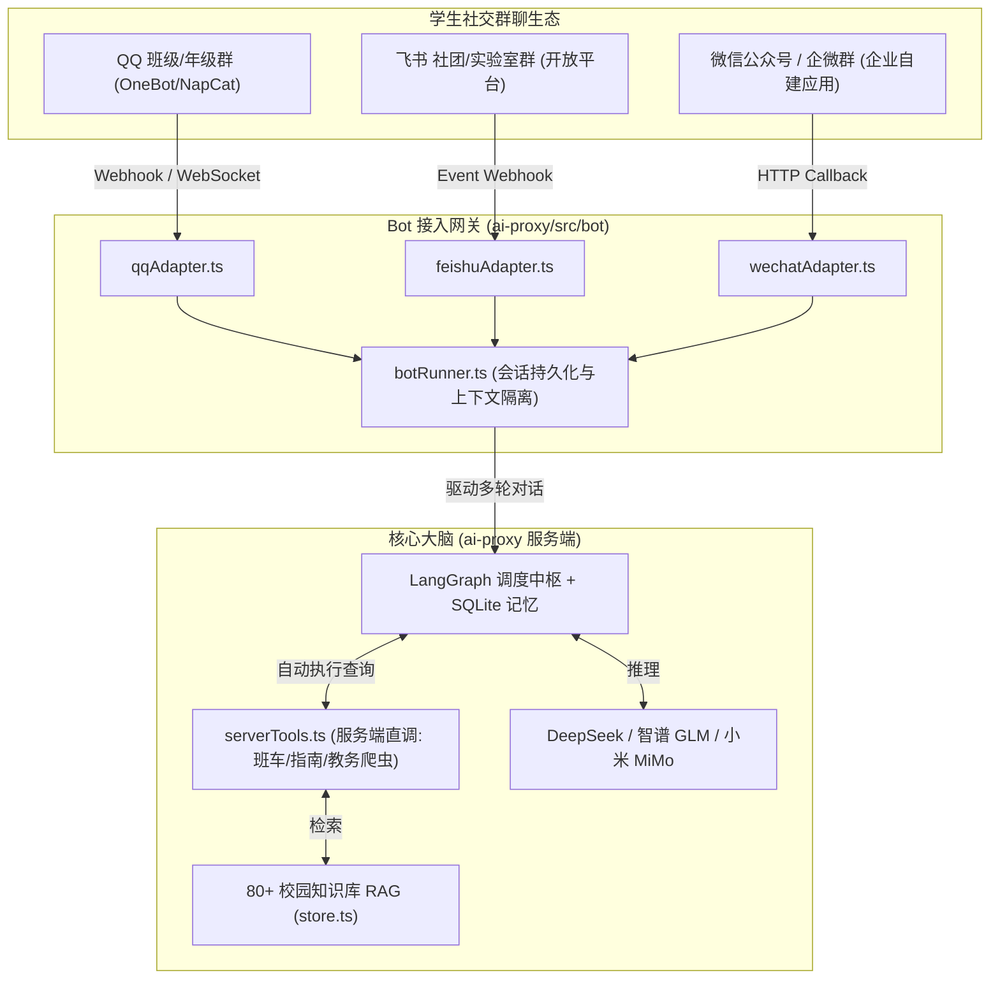

# 电子科技大学成电助手（Helper App）
## 校园群聊智能 Bot（QQ / 飞书 / 微信公众号）接入与落地评估报告

> **文档归档路径**：`D:\harmony\helper_app\doc\评估\CAMPUS_BOT_IMPLEMENTATION_GUIDE.md`  
> **适用平台**：QQ 班级/专业群、飞书团队/社团群、微信公众号 / 企业微信  
> **技术架构**：Bot 开放平台协议适配器 + `ai-proxy` (LangGraph + Server-Side Tool Execution + 知识库 RAG)  
> **报告编制日期**：2026-08-27  

---

## 目录

1. [方案概述与核心传播价值](#1-方案概述与核心传播价值)
2. [能做到哪些功能（功能清单与真实群聊交互演示）](#2-能做到哪些功能功能清单与真实群聊交互演示)
3. [系统技术架构与具体实施步骤](#3-系统技术架构与具体实施步骤)
4. [需要您（用户/开发者）配合准备的事项 (Action Items)](#4-需要您用户开发者配合准备的事项-action-items)
5. [工期排期与上线验收 Checklist](#5-工期排期与上线验收-checklist)

---

## 1. 方案概述与核心传播价值

### 1.1 为什么接入校园群聊 Bot？

在大学校园环境中，**学生日常活跃时间最长、互动频次最高的场景是各类学生大群、班级通知群、课程讨论群与社团工作群**。

将本项目的核心 AI 与知识库能力接入校园群聊 Bot 具有极其显著的优势：
1. **零使用门槛与自发裂变**：不需要用户去应用商店搜索下载、不需要记住网站域名，在群里 `@成电助手` 即可随时提问，一个群内的提问能让全群数百人看到回答，具备极强的校园自传播效应。
2. **免应用商店与客户端审查**：Bot 作为聊天工具内的机器人应用，无需走移动端 App 的工信部备案、大模型资质审批与软著流程，依靠已有的 `ai-proxy` 服务端即可快速投产。
3. **100% 最大化释放已建资产价值**：本项目已积累的 **80+ 校园指南知识库、成电班车时刻表、教务官网新闻爬虫、DeepSeek 多模型推理** 可以直接作为机器人的“知识储备”，无需开发复杂的前端 UI 界面。

---

## 2. 能做到哪些功能（功能清单与真实群聊交互演示）

### 2.1 完整功能清单

| 功能类别 | 群 Bot 支持能力 | 典型应用场景与触发方式 |
|---|---|---|
| **成电班车时刻问答** | 智能解析时间与校区，自动检索班次与下一班发车倒计时 | `@成电助手 明天下午从清水河去沙河的班车有哪些？` |
| **80+ 校园办事指南 RAG** | 毫秒级知识库匹配，输出精准的开放时间、电话、办事流程 | `@成电助手 校医院周末可以拔牙吗？`、`@成电助手 补办学生证去哪儿？` |
| **教务处官网实时检索** | 实时联网爬取成电教务处最新公告并提炼摘要 | `@成电助手 教务处最近有什么关于选课和补考的通知？` |
| **学术伴学与多模型推理** | 深度思考（DeepSeek-R1 / V3），支持代码调试、公式推导、论文思路 | `@成电助手 帮我解释一下数字信号处理里的快速傅里叶变换 (FFT) 原理` |
| **群内多轮连续对话** | 基于 `群ID_用户ID` 自动维护独立会话上下文，支持追问 | `用户追问：那这趟班车周日有吗？`（Bot 能自动关联上文） |
| **富文本排版与交互卡片** | 飞书/QQ 支持渲染 Markdown 列表、加粗、代码块及图文卡片 | 结构化输出班车时刻表与指南条目，清晰易读。 |

### 2.2 真实群聊交互场景演示

```markdown
> 场景一：班车时刻查询
[同学 A]: @成电助手 今晚沙河回清水河最后一班车是几点？
[成电助手]: 🚌 沙河校区 ➔ 清水河校区 今日班车提醒：
- 今日最后一班校车发车时间为：21:30（工作日/双休日均有）。
- 乘车地点：沙河校区主楼东侧班车停靠点。
- 距离发车还有：1小时15分钟，请提前10分钟到达乘车点刷校园卡乘车。

---

> 场景二：校园办事与生活指南
[同学 B]: @成电助手 游泳馆几点关门？学生票多少钱？
[成电助手]: 🏊 清水河校区游泳馆指南：
- 开放时间：周一至周日 14:00 - 21:30（21:00 停止入场）。
- 收费标准：成电在校学生凭校园卡 15 元/次（单次限时 90 分钟）。
- 入场要求：需佩戴泳帽并携带校园卡核验身份。

---

> 场景三：教务新闻检索
[同学 C]: @成电助手 最近教务处有发免试推免相关的通知吗？
[成电助手]: 📢 为您检索到成电教务处最新动态：
1. 《关于开展 2027 届本科毕业生推荐免试攻读研究生综合测评工作的通知》（发布时间：2026-08-20）
- 摘要：各学院已启动测评细则公示，材料提交截止日期为 9 月 10 日。
- 详情链接：https://www.jwc.uestc.edu.cn/...
```

---

## 3. 系统技术架构与具体实施步骤



### 3.1 具体实施步骤

#### 步骤一：服务端工具执行闭环改造（Server-Side Execution）
* **核心变化**：在鸿蒙 App 模式下，查询工具是通过 SSE 下发给手机客户端执行的；但在群 Bot 模式下，**必须由 `ai-proxy` 服务端直接执行工具并返回结果给大模型**。
* **新建 `src/bot/serverTools.ts`**：
  - `serverCampusSearchTool`：直接在 Node.js 内存中调用 `campusKnowledge.search()` 返回匹配的指南；
  - `serverBusScheduleTool`：直接调用 `buildBusSchedulePayload()` 过滤出当前可用的班车班次；
  - `serverJwcScraperTool`：直接调用 `searchJwcWebsite()` 抓取教务处官网。

#### 步骤二：编写 Bot 统一路由与会话管理器 (`src/bot/botRunner.ts`)
1. **会话唯一标识隔离**：
   - 规则：`sessionId = bot_${platform}_${groupId}_${userId}`。
   - 效果：同一个同学在群里的连续追问能够继承上下文，不同同学之间的提问互不干扰。
2. **群聊定制 System Prompt**：
   - 注入群聊专属角色设定：“**回答简明扼要，优先使用 Emoji 与列表排版，关键信息加粗，单条回答控制在 300 字以内，适合手机群聊快速阅读**”。
3. **意图快筛短路**：
   - 针对纯表情包、空消息或打招呼（“你好”、“在吗”），通过预处理器直接 0 毫秒秒回，不消耗大模型 Token。

#### 步骤三：平台协议适配器开发（多选一或全部支持）

1. **QQ 机器人接入（学生群体首选）**：
   - **方式 A（推荐，极简内测）**：使用开源的 `NapCatQQ` / `LLOneBot` 将一个专用校园 QQ 小号作为 Bot，通过 WebSocket 连接 `ai-proxy`。
   - **方式 B（官方 Bot）**：通过 QQ 开放平台申请官方频道/群机器人，配置 Webhook 事件接收。
2. **飞书机器人接入（团队/社团首选）**：
   - 引入官方 SDK `@larksuiteoapi/node-sdk`；
   - 在 `ai-proxy` 中注册 `POST /api/bot/webhook/feishu`，处理 URL Challenge 与消息事件。
3. **微信公众号 / 企业微信接入**：
   - 注册 `POST /api/bot/webhook/wechat` 接口，接收微信 XML/JSON 消息并同步返回 AI 生成文本。

#### 步骤四：安全防护与群聊防刷机制
1. **群级别与用户级别频控（Rate Limiting）**：
   - 单用户每分钟限制提问 5 次，单群每分钟限制提问 20 次，防止恶意刷屏或滥用 Token；
2. **群白名单机制**：
   - 支持在 `.env` 中配置 `ALLOWED_BOT_GROUPS=group1,group2`，仅在指定班级群/测试群内响应。

---

## 4. 需要您（用户/开发者）配合准备的事项 (Action Items)

为了让群聊 Bot 顺利上线，您需要根据想要接入的平台提供或准备以下物料：

```
┌────────────────────────────────────────────────────────────────────────┐
│                      群聊 Bot 落地物料与操作清单                        │
├────┬──────────────────────┬────────────────────────────────────────────┤
│ 序号│ 平台分类             │ 具体需要您做的工作 / 提供的材料            │
├────┼──────────────────────┼────────────────────────────────────────────┤
│ 1  │ **平台选型确定**     │ 确认第一阶段优先接入哪一个平台（QQ群 /     │
│    │                      │ 飞书 / 微信公众号）。                      │
├────┼──────────────────────┼────────────────────────────────────────────┤
│ 2  │ **如果是 QQ 机器人** │ - 方式 A（QQ小号方案）：准备一个专用于校园 │
│    │                      │   助手的 QQ 账号用于登录 NapCat 协议端；   │
│    │                      │ - 方式 B（官方开放平台）：提供 QQ 开放平台 │
│    │                      │   的 `AppID` 和 `Token`。                  │
├────┼──────────────────────┼────────────────────────────────────────────┤
│ 3  │ **如果是飞书机器人** │ 在飞书开发者后台创建自建应用，提供 `App ID │
│    │                      │ ` 和 `App Secret`，开启机器人能力并发布。  │
├────┼──────────────────────┼────────────────────────────────────────────┤
│ 4  │ **公网接收端点**     │ 确保云服务器 `ai-proxy` 具备公网访问能力， │
│    │                      │ 用于接收飞书/QQ/微信的 Webhook 回调通知。  │
├────┼──────────────────────┼────────────────────────────────────────────┤
│ 5  │ **白名单与频控设置** │ 告知首批用于测试的群号/群名称，用于配置测  │
│    │                      │ 试白名单。                                 │
└────┴──────────────────────┴────────────────────────────────────────────┘
```

---

## 5. 工期排期与上线验收 Checklist

### 5.1 实施时间表（预计 1 天完成）

```
Day 1 上午：服务端工具闭环与核心路由
  ├── 在 ai-proxy 中实现 serverTools.ts (班车、指南、教务直调)
  ├── 编写 botRunner.ts 处理群聊会话隔离与专属 Prompt
  └── 编写群聊频控与白名单过滤逻辑

Day 1 下午：协议适配器联调与上线
  ├── 编写选定平台的 Webhook 接收模块（如飞书或 QQ NapCat）
  ├── 在实际测试群内进行多轮提问、班车查询、指南搜索联调
  └── 交付群内正式使用
```

### 5.2 交付验收清单
- [ ] 在群内 `@成电助手` 发送班车查询，机器人能在 2 秒内准确回复发车时间与地点；
- [ ] 提问校医院、场馆开放时间，能准确命中成电 80+ 校园指南；
- [ ] 支持群内连续追问，且群内多位同学同时提问时互不冲突、不串会话；
- [ ] 单人频繁连续发送消息时，能正确触发防刷提示，保障后端 API 额度安全。
