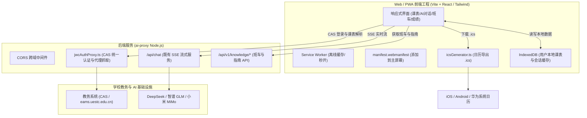

# 电子科技大学成电助手（Helper App）
## Web / PWA 跨平台网页版实施与落地评估报告

> **文档归档路径**：`D:\harmony\helper_app\doc\评估\WEB_PWA_IMPLEMENTATION_GUIDE.md`  
> **适用平台**：全平台浏览器（iOS Safari / Android Chrome / 华为鸿蒙浏览器 / PC Windows / Mac / Linux）  
> **技术架构**：React / Vite 前端 + PWA (Service Worker + Manifest) + 现有 `ai-proxy` Node.js 后端服务  
> **报告编制日期**：2026-08-27  

---

## 目录

1. [方案概述与核心商业/合规价值](#1-方案概述与核心商业合规价值)
2. [能做到哪些功能（功能清单与体验对比）](#2-能做到哪些功能功能清单与体验对比)
3. [系统技术架构与具体实施步骤](#3-系统技术架构与具体实施步骤)
4. [需要您（用户/开发者）配合准备的事项 (Action Items)](#4-需要您用户开发者配合准备的事项-action-items)
5. [工期排期与部署上线 Checklist](#5-工期排期与部署上线-checklist)

---

## 1. 方案概述与核心商业/合规价值

### 1.1 为什么推荐 Web / PWA 网页版？

在 [`AGC_RELEASE_GUIDE.md`](./AGC_RELEASE_GUIDE.md) 中，上架华为应用市场（AGC）与微信小程序面临三大“硬骨头”：
- **法律资质高门槛**：必须具备《计算机软件著作权》、工信部 App 备案、网信办生成式 AI 算法备案（网信算备）；
- **教务爬虫合规审查**：应用商店对抓取学校内网教务有极严的官方授权要求，个人开发者几乎无法通过；
- **平台与设备割裂**：当前原生 ArkTS 工程仅支持 HarmonyOS NEXT 设备，iOS、安卓与 PC 同学无法使用。

**Web / PWA（渐进式 Web 应用）方案能够彻底解决上述所有痛点：**
1. **零应用商店审核**：不需要经过华为、苹果或微信官方的任何人工审核，只要服务器与域名正常运行即可直接上线，更新秒级下发，无发版等待期。
2. **无算法与教务资质卡点**：不受应用商店关于“生成式 AI 备案”与“教务数据合规”的硬性资质封锁。
3. **PWA 原生级体验**：在 Safari、Chrome、华为浏览器中点击“**添加到主屏幕**”，即可生成独立 App 图标，具备全屏沉浸展示、离线秒开能力。
4. **全平台师生 100% 覆盖**：苹果 iPhone、各类 Android 手机、鸿蒙手机、Windows/Mac 电脑均可直接打开。

---

## 2. 能做到哪些功能（功能清单与体验对比）

### 2.1 完整功能清单

| 功能模块 | Web / PWA 网页版实现方式 | 能够实现的效果 / 体验 |
|---|---|---|
| **AI 伴学助手** | 100% 复用 `ai-proxy` SSE 流式接口 | 实时流式打字机输出、DeepSeek-R1 / MiMo 深度思考折叠卡片（带毫秒计时）、成电 80+ 校园指南检索、Markdown 语法渲染与代码高亮。 |
| **智能课表看板** | 移植纯 TS `SemesterConfig` 与课表模型 | 自动计算当前教学周与星期；支持周课表网格视图、日课表时间线；展示课程名、任课老师、教室地点与节次。 |
| **成电班车时刻** | 移植纯 TS `BusScheduleModel` | 双校区（沙河 ⇋ 清水河）发车班次自由切换；工作日/节假日自动判定；下一班发车动态倒计时卡片。 |
| **教务实时同步** | 内存级 CAS 代理模块（`jwcAuthProxy`） | 同学输入统一身份认证学号/密码，后端内存中转抓取最新课表、考试排期与成绩，凭证用完即弃，不落地存储。 |
| **系统日历写入** | **生成通用 `.ics`（iCalendar）标准日历文件** | 替代鸿蒙 `CalendarKit`：点击“同步到日历”，浏览器自动生成并下载 `.ics` 文件，手机一键自动导入 iPhone 日历、华为日历、安卓日历或 Outlook。 |
| **考试与成绩** | 本地 IndexedDB 缓存解析数据 | 考试倒计时卡片、挂科预警、GPA 与学分绩点统计图表。 |
| **桌面快捷方式** | PWA Web App Manifest + Service Worker | “添加到主屏幕”后，拥有独立桌面图标，无浏览器顶部地址栏和底部工具栏，支持离线骨架屏加载。 |

### 2.2 Web/PWA 版 vs HarmonyOS NEXT 原生版 深度对比

```
┌──────────────────────────────────────┬──────────────────┬──────────────────┐
│ 功能与体验维度                       │ HarmonyOS 原生版 │ Web / PWA 网页版 │
├──────────────────────────────────────┼──────────────────┼──────────────────┤
│ 1. 覆盖设备类型                      │ 仅限鸿蒙 NEXT 设备│ 全平台 (iOS/安卓/PC)│
│ 2. 免审核快速上线                    │ ❌ (审核严格)     │ ✅ (零审核秒上线)  │
│ 3. AI 伴学助手与流式思考             │ ✅ (支持)         │ ✅ (100% 完整支持) │
│ 4. 课表、班车与指南查询              │ ✅ (支持)         │ ✅ (100% 完整支持) │
│ 5. 系统日历写入                      │ ✅ (CalendarKit)  │ ✅ (导出 .ics 文件)│
│ 6. 桌面万能服务卡片 (Widget 2x2/2x4) │ ✅ (原生支持)     │ ❌ (PWA 无法做桌面卡片)│
│ 7. 全局伴随悬浮窗 (SubWindow)        │ ✅ (原生支持)     │ ❌ (仅限网页内悬浮)│
│ 8. 本地安全存储                      │ Preferences      │ IndexedDB / LocalStorage│
└──────────────────────────────────────┴──────────────────┴──────────────────┘
```

---

## 3. 系统技术架构与具体实施步骤



### 3.1 具体实施步骤

#### 步骤一：创建前端 Web 工程与 PWA 基础配置
1. **初始化前端项目**：在项目根目录或独立目录建立 `web-app`（推荐使用 `Vite + React + Tailwind CSS + Lucide Icons`，打包体积小、启动快）。
2. **配置 PWA 清单** (`public/manifest.webmanifest`)：
   - 配置应用名称（`成电助手`）、主题色（`#2563eb`）、启动模式（`standalone`）与 192x192 / 512x512 高清应用图标。
3. **注册 Service Worker 离线缓存**：使用 `vite-plugin-pwa` 实现静态资源自动缓存，二次进入页面 0 毫秒秒开。

#### 步骤二：移植纯 TypeScript 业务模型
由于 HarmonyOS NEXT 工程中已经严格遵循纯 TS Model 规范，以下文件**可以直接重命名为 `.ts` 放入 Web 前端复用**：
- `model/BusScheduleModel.ets` ➔ 班车发车计算、双校区时刻过滤；
- `model/SemesterConfig.ets` ➔ 教学周次自动换算、学期第一天锚点计算；
- `model/GradeModel.ets` & `ExamModel.ets` ➔ 成绩 GPA 计算与考试排序。

#### 步骤三：开发前端核心页面组件
- **AI 对话页 (`ChatPage.tsx`)**：
  - 基于 `fetch` + `ReadableStream` 接收后端的 SSE 数据流；
  - 渲染深度思考（Reasoning）折叠卡片与流式 Markdown 打字机效果。
- **课表看板 (`TimetablePage.tsx`)**：
  - 响应式周课表与日课表网格，支持切换教学周次，高亮当天当前正在上的课程。
- **成电班车 (`BusSchedulePage.tsx`)**：
  - 沙河 ⇋ 清水河双校区一键切换，动态显示“距离下班车发车还有 XX 分钟”。
- **通用日历导出器 (`utils/icsGenerator.ts`)**：
  - 编写根据课表数组生成标准 `.ics` 字符串并调起浏览器下载的函数。

#### 步骤四：后端 `ai-proxy` 补充 CORS 与教务代理
1. **安装 CORS 依赖**：
   ```bash
   cd "C:\Users\28399\Desktop\华为云\后端服务\ai-proxy"
   npm install cors @types/cors
   ```
2. **在 `src/index.ts` 中启用 CORS**：
   ```typescript
   import cors from 'cors'
   app.use(cors({ origin: '*', methods: ['GET', 'POST', 'OPTIONS'] }))
   ```
3. **补充教务抓取代理模块 (`src/jwcAuthProxy.ts`)**：
   - 解决浏览器直接请求学校教务网引起的跨域与 Cookie 策略拦截；
   - 接收前端提交的登录凭证，在 Node.js 端向 CAS 发送认证并获取课表 HTML，解析后以 JSON 格式返回给前端。

#### 步骤五：生产构建与 Web 服务器部署
1. 前端执行 `npm run build` 生成 `dist/` 静态资源目录；
2. 配置 Nginx 托管静态文件并反向代理 `ai-proxy`，配置 SSL 证书（HTTPS）。

---

## 4. 需要您（用户/开发者）配合准备的事项 (Action Items)

为了将 Web/PWA 方案落地，您需要确认或准备以下几项资源：

```
┌────────────────────────────────────────────────────────────────────────┐
│                     Web / PWA 落地物料与操作清单                        │
├────┬──────────────────────┬────────────────────────────────────────────┤
│ 序号│ 事项分类             │ 具体需要您做的工作 / 提供的材料            │
├────┼──────────────────────┼────────────────────────────────────────────┤
│ 1  │ **服务器环境**       │ 确认当前运行 `ai-proxy` 的云服务器（或准备 │
│    │                      │ 一台轻量云主机，如华为云/腾讯云 Linux）。  │
├────┼──────────────────────┼────────────────────────────────────────────┤
│ 2  │ **域名与 HTTPS 证书**│ 准备一个二级域名（如 `helper.yourdomain.com│
│    │                      │ `），并申请免费 SSL 证书（PWA 强制要求     │
│    │                      │ HTTPS 协议才能唤起“添加到桌面”）。         │
├────┼──────────────────────┼────────────────────────────────────────────┤
│ 3  │ **教务测试验证账号** │ 提供一个测试用的统一身份认证学号，用于验证 │
│    │                      │ 后端 CAS 代理抓取与课表解析链路。          │
├────┼──────────────────────┼────────────────────────────────────────────┤
│ 4  │ **UI 风格与文案确认**│ 确认前端 Web 端的主题配色、免责声明文案以  │
│    │                      │ 及部署后的访问路径。                       │
└────┴──────────────────────┴────────────────────────────────────────────┘
```

---

## 5. 工期排期与部署上线 Checklist

### 5.1 实施时间表（预计 2.5 天完成）

```
Day 1：前端工程搭建与模型迁移
  ├── 初始化 Vite + React + Tailwind + PWA 工程
  ├── 迁移 BusScheduleModel、SemesterConfig 等纯 TS 模型
  └── 调通 SSE 流式 AI 对话页面（实现 Markdown 打字机与折叠思考）

Day 2：核心看板开发与教务代理
  ├── 课表看板、班车倒计时、校园指南页面开发
  ├── 编写 .ics 日历导出工具并在真机（iOS/Android）上实测导入系统日历
  └── 在 ai-proxy 中实现 CORS 跨域支持与 jwcAuthProxy 教务中转

Day 3 (半天)：打包部署与测试验证
  ├── 执行 build 打包并部署至 Nginx
  ├── 配置 SSL 证书并测试 PWA “添加到主屏幕” 功能
  └── 全功能联调上线
```

### 5.2 交付验收清单
- [ ] 手机浏览器打开链接，能成功弹出“添加到主屏幕”提示，添加后图标与标题展示正确；
- [ ] AI 对话支持 DeepSeek 流式下行，能够正常检索成电 80+ 校园知识库；
- [ ] 班车时刻表与当前教学周计算准确；
- [ ] 课表一键导出 `.ics` 文件，可在苹果日历/华为日历中直接添加为日程排期；
- [ ] 用户密码仅在内存中转发，无任何数据库持久化存储，保障数据安全。
