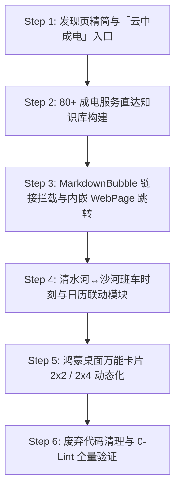

# 🛠️ 成电助手（UESTC Helper）代码重构与功能落地实施手册

> **定位**：供 AI Agent / 开发者直接对照执行的代码级工程改造指南。  
> **原则**：按步骤顺序推进、文件路径与改动点精确到函数/组件、严格遵守分层架构与纯 TS Model 约束。

---

## 阶段总览与执行顺序



---

## Step 1: 发现页（Quick）重构与「云中成电」核心入口 ✅ **[已完成]**

### 1.1 目标
- 移除无实际功能的占位项（`计算器`、`天气`、`校园卡`）；
- 新增「云中成电」（`https://online.uestc.edu.cn/`）和「成电班车」入口；
- 规范入口路由与外链分发逻辑。

### 1.2 代码修改清单

#### ① 常量定义：[`Application/entry/src/main/ets/common/constants/AppConstants.ets`](file:///d:/harmony/helper_app/Application/entry/src/main/ets/common/constants/AppConstants.ets)
- 确认/新增外链与路由常量：
```typescript
// AppConstants.ets
export class AppConstants {
  static readonly ONLINE_URL: string = 'https://online.uestc.edu.cn/';
  static readonly GIS_MAP_URL: string = 'https://gis.uestc.edu.cn/#/';
  static readonly LIB_FULL_URL: string = 'https://www.lib.uestc.edu.cn/engine2/general/more?appId=4483334&websiteId=464744&wfwfid=22855&pageId=877838&typeId=10937088&currentBranch=1';
  static readonly QINGSHUI_RIVER_URL: string = 'https://bbs.uestc.edu.cn/new';
  static readonly CARD_BALANCE_URL: string = 'https://mapp.uestc.cn/site/ipasscd/index';
}

export class RouterConstants {
  static readonly PAGE_BUS_SCHEDULE: string = 'pages/schedulePages/BusSchedulePage';
  // ... 其余已有常量保持不变
}
```

#### ② 发现页数据模型与网格组件：[`Application/entry/src/main/ets/components/home/QuickLinksGrid.ets`](file:///d:/harmony/helper_app/Application/entry/src/main/ets/components/home/QuickLinksGrid.ets)
- 优化 `HomeToolItem` 列表展示，新增云中成电头部 Hero 推广横幅或首位核心卡片；
- 支持区分 `route`（应用内页面）与 `url`（内嵌 WebPage）。

#### ③ 主页面工具列表：[`Application/entry/src/main/ets/pages/Index.ets`](file:///d:/harmony/helper_app/Application/entry/src/main/ets/pages/Index.ets)
- 修改 `MainPage` 内的 `tools` 列表定义：
```typescript
private tools: HomeToolItem[] = [
  { title: '云中成电', icon: '☁️', color: '#0A59F7', url: AppConstants.ONLINE_URL, iconImage: $r('app.media.ic_cloud_uestc') },
  { title: '成电班车', icon: '🚌', color: '#10B981', route: RouterConstants.PAGE_BUS_SCHEDULE, iconImage: $r('app.media.ic_bus_schedule') },
  { title: 'AI 助手', icon: '🤖', color: '#6366F1', route: RouterConstants.PAGE_ASSISTANT, iconImage: $r('app.media.ic_ai_assistant') },
  { title: '成绩查询', icon: '📊', color: '#EC4899', route: RouterConstants.PAGE_GRADE },
  { title: '校园地图', icon: '🗺️', color: '#3B82FF', url: AppConstants.GIS_MAP_URL, iconImage: $r('app.media.ic_campus_map') },
  { title: '图书馆', icon: '📚', color: '#06B6D4', url: AppConstants.LIB_FULL_URL },
  { title: '校园日历', icon: '📅', color: '#84CC16', route: RouterConstants.PAGE_CALENDAR },
  { title: '清水河畔', icon: '🌊', color: '#0EA5E9', url: AppConstants.QINGSHUI_RIVER_URL, iconImage: $r('app.media.ic_qingshui_river') },
  { title: '一卡通余额', icon: '💰', color: '#F97316', url: AppConstants.CARD_BALANCE_URL, iconImage: $r('app.media.ic_card_balance') }
];
```

---

## Step 2: AI 知识库构建（80+ 校内服务直达库 + 成电百事通）

### 2.1 目标
- 全量提炼 `D:\harmony\helper_app\temp\云中成电.html` 中的 80+ 项服务，结构化为 JSON 知识库；
- 后端 RAG 检索器支持基于关键词/语义召回对应服务直达链接；
- 提示词要求大模型在推荐校内服务时输出标准 Markdown 链接 `[服务名称](URL)`。

### 2.2 代码修改清单

#### ① 新建服务导航知识库：[`ai-proxy/src/knowledge/data/campus_services.json`](file:///c:/Users/28399/Desktop/华为云/后端服务/ai-proxy/src/knowledge/data/)
- 结构定义：
```json
[
  {
    "id": "service_student_email",
    "name": "学生邮箱",
    "category": "public_info",
    "keywords": ["邮箱", "学生邮箱", "email", "mail", "网易企业邮箱"],
    "description": "电子科技大学学生官方邮箱系统，域名为 @std.uestc.edu.cn，支持统一身份认证登录。",
    "url": "https://mail.std.uestc.edu.cn/",
    "guide": "用户名一般为学号，初始密码或统一身份认证后即可登录使用。"
  },
  {
    "id": "service_software",
    "name": "正版软件",
    "category": "public_info",
    "keywords": ["正版软件", "Windows激活", "Office激活", "MATLAB", "正版化"],
    "description": "电子科技大学正版软件管理与服务平台，为全校师生免费提供 Windows、Office、MATLAB、SPSS 等正版授权与KMS激活。",
    "url": "https://software.uestc.edu.cn/",
    "guide": "需在校园网内或通过 WebVPN 访问平台下载客户端或获取激活脚本。"
  },
  {
    "id": "service_dorm_power",
    "name": "寝室电费充值",
    "category": "life_service",
    "keywords": ["电费", "充水费", "宿舍电费", "寝室电费", "买电"],
    "description": "清水河与沙河校区宿舍电费线上缴费充值系统。",
    "url": "https://mapp.uestc.cn/site/ipasscd/index",
    "guide": "进入一卡通服务大厅 -> 选择寝室购电 -> 选择校区与楼栋房间号进行充值。"
  },
  {
    "id": "service_lib_room",
    "name": "图书馆研修室、报告厅等预约",
    "category": "academic_research",
    "keywords": ["研修室", "研讨室", "图书馆预约", "报告厅", "自习室预约"],
    "description": "电子科技大学图书馆研讨室、研修室、报告厅线上预约系统。",
    "url": "https://room.lib.uestc.edu.cn/",
    "guide": "提前 1-3 天使用统一身份认证登录系统选择时段与房间发起预约，需按时签到。"
  },
  {
    "id": "service_vpn",
    "name": "校园VPN系统",
    "category": "public_info",
    "keywords": ["VPN", "WebVPN", "校外访问", "内网"],
    "description": "成电 WebVPN 与 EasyConnect VPN 门户，支持在校外免客户端直接访问校内所有教务与学术资源。",
    "url": "https://webvpn.uestc.edu.cn/",
    "guide": "校外直接浏览器打开 webvpn.uestc.edu.cn，使用统一身份认证登录即可。"
  },
  {
    "id": "service_grad_school",
    "name": "研究生系统",
    "category": "academic_affairs",
    "keywords": ["研究生系统", "研究生教务", "研究生培养", "GMIS"],
    "description": "电子科技大学研究生院综合管理信息系统（选课、开题、答辩、培养计划）。",
    "url": "https://yjsy.uestc.edu.cn/",
    "guide": "使用研究生统一身份认证登录，管理培养计划与学位申请。"
  }
]
```

#### ② 知识库加载与检索器扩展：[`ai-proxy/src/knowledge/store.ts`](file:///c:/Users/28399/Desktop/华为云/后端服务/ai-proxy/src/knowledge/store.ts)
- 在 `CampusKnowledgeStore` 中注册加载 `campus_services.json`；
- 在 `search(query, category)` 中增加对校内服务名称与关键词的加权匹配：
```typescript
// store.ts 扩充 search 逻辑
export class CampusKnowledgeStore {
  // 加载 campus_services
  private services: CampusServiceItem[] = [];
  
  public searchServices(query: string): CampusServiceItem[] {
    const q = query.toLowerCase();
    return this.services.filter(s => 
      s.name.toLowerCase().includes(q) || 
      s.keywords.some(k => k.toLowerCase().includes(q)) ||
      s.description.toLowerCase().includes(q)
    );
  }
}
```

#### ③ Prompt 格式约束：[`ai-proxy/src/prompt.ts`](file:///c:/Users/28399/Desktop/华为云/后端服务/ai-proxy/src/prompt.ts)
- 在 System Prompt 中增加「校内服务直达格式规范」：
```text
【校内服务与系统推荐规范】
当用户询问校内任何办事流程、网站入口或系统使用时（如邮箱、电费、正版软件、VPN、学工、图书馆预约等）：
1. 简要说明办理步骤与注意事项；
2. 必须在回答末尾或对应段落提供标准的 Markdown 链接供用户直接点击跳转，例如：
   👉 [点击进入成电学生邮箱](https://mail.std.uestc.edu.cn/)
   👉 [点击进入寝室电费充值](https://mapp.uestc.cn/site/ipasscd/index)
```

---

## Step 3: 端侧 MarkdownBubble 原生链接拦截与内嵌 WebPage 跳转

### 3.1 目标
- 让 `MarkdownBubble.ets` 能够解析 Markdown 格式的超链接 `[链接文本](URL)`；
- 点击链接时，拦截并自动调用 `router.pushUrl({ url: RouterConstants.PAGE_WEB, params: { title: linkText, url: linkUrl } })`，在 App 内嵌浏览器中无缝打开，不跳出应用。

### 3.2 代码修改清单

#### ① Markdown 解析与渲染器改造：[`Application/entry/src/main/ets/components/agent/MarkdownBubble.ets`](file:///d:/harmony/helper_app/Application/entry/src/main/ets/components/agent/MarkdownBubble.ets)
- 在分词与节点类型中增加 `LinkNode`：
```typescript
export interface MarkdownLinkNode {
  type: 'link';
  text: string;
  url: string;
}
```
- 解析行内内容时，识别 `\[(.*?)\]\(((?:https?:\/\/|\/pages\/)[^\s\)]+)\)` 正则；
- 在渲染该节点时，构建高亮带下划线的蓝色胶囊或文本按钮：
```typescript
@Builder
renderLink(text: string, url: string) {
  Row({ space: 4 }) {
    Image($r('app.media.ic_link')) // 或 link icon
      .width(14)
      .height(14)
      .fillColor($r('app.color.primary_color'))
    Text(text)
      .fontSize(14)
      .fontWeight(FontWeight.Medium)
      .fontColor($r('app.color.primary_color'))
      .decoration({ type: TextDecorationType.Underline, color: $r('app.color.primary_color') })
  }
  .padding({ left: 8, right: 8, top: 4, bottom: 4 })
  .backgroundColor($r('app.color.accent_bg_color'))
  .borderRadius(6)
  .margin({ top: 4, bottom: 4 })
  .onClick(() => {
    this.handleLinkClick(text, url);
  })
}

private handleLinkClick(title: string, url: string): void {
  if (url.startsWith('pages/')) {
    router.pushUrl({ url: url }).catch((e: Error) => console.error('[MarkdownBubble] 跳转页面失败', e));
  } else if (url.startsWith('http://') || url.startsWith('https://')) {
    router.pushUrl({
      url: RouterConstants.PAGE_WEB,
      params: { title: title, url: url }
    }).catch((e: Error) => console.error('[MarkdownBubble] 打开网页失败', e));
  }
}
```

#### ② 内嵌 Web 容器页面检查：[`Application/entry/src/main/ets/pages/classTablePages/WebPage.ets`](file:///d:/harmony/helper_app/Application/entry/src/main/ets/pages/classTablePages/WebPage.ets)
- 确保具备顶部原生导航栏（带返回按钮、网页标题、刷新按钮）；
- 开启 `domStorageAccess(true)` 和 `javaScriptAccess(true)` 支持统一身份认证。

---

## Step 4: 清水河↔沙河班车时刻与日历联动模块

### 4.1 目标
- 创建清水河与沙河双校区班车时刻表页面（支持工作日/周末切换、发车倒计时、高亮下一班车）；
- 提供「🔔 写入日历」功能，自动在发车前 15 分钟写入 HarmonyOS `@kit.CalendarKit` 并去重。

### 4.2 代码修改清单

#### ① 新建班车数据模型：[`Application/entry/src/main/ets/model/BusScheduleModel.ets`](file:///d:/harmony/helper_app/Application/entry/src/main/ets/model/BusScheduleModel.ets)
```typescript
export interface BusItem {
  id: string;
  time: string;           // "07:30"
  departure: 'qsh' | 'sh'; // qsh=清水河, sh=沙河
  destination: 'sh' | 'qsh';
  isWorkdayOnly: boolean;  // 是否仅工作日
  isWeekendOnly: boolean;  // 是否仅周末
  routeDescription: string;// "清水河主楼 -> 西区科技园 -> 沙河主楼"
  busType: string;         // "教工大巴" | "学生班车" | "加班车"
}

export class BusScheduleModel {
  static readonly QSH_TO_SH_WORKDAY: string[] = [
    '06:40', '07:10', '07:30', '08:30', '09:30', '10:30', '11:30', 
    '12:30', '13:00', '14:00', '15:00', '16:00', '17:00', '17:40', 
    '18:40', '20:00', '21:30', '22:30'
  ];
  static readonly SH_TO_QSH_WORKDAY: string[] = [
    '07:00', '07:30', '08:30', '09:30', '10:30', '11:30', '12:30', 
    '13:30', '14:30', '15:30', '16:30', '17:00', '17:40', '18:30', 
    '20:00', '21:30', '22:30'
  ];
  // 周末及节假日时刻表数据...
  
  static getNextBus(departure: 'qsh' | 'sh', isWeekend: boolean): { time: string; minutesLeft: number } | null {
    // 纯 TS 计算当前时间后的下一班车与剩余分钟数
  }
}
```

#### ② 新建班车页面：[`Application/entry/src/main/ets/pages/schedulePages/BusSchedulePage.ets`](file:///d:/harmony/helper_app/Application/entry/src/main/ets/pages/schedulePages/BusSchedulePage.ets)
- 包含：
  - 顶部双向校区切换（清水河 ➔ 沙河 / 沙河 ➔ 清水河）；
  - 「下一班车」Hero 倒计时卡片；
  - 工作日 / 周末时刻表 Tab 切换列表；
  - 列表项右侧「🔔 写入日历提醒」按钮，调用 `CalendarKitReminderService.createBusReminder(context, busItem)`.

#### ③ 日历写入与去重服务扩展：[`Application/entry/src/main/ets/service/CalendarKitReminderService.ets`](file:///d:/harmony/helper_app/Application/entry/src/main/ets/service/CalendarKitReminderService.ets)
- 增加 `createBusReminder` 方法，按 `bus_${date}_${departure}_${time}` 生成唯一键，避免重复写入。

---

## Step 5: 鸿蒙桌面万能服务卡片（Form Widget）全面动态化

### 5.1 目标
- 改造 `2x2` 卡片：动态展示下一节课倒计时、教室与时间；
- 新增 `2x4` 卡片：展示今日全天 1-12 节课表时间线与日程；
- 实现课程导入/变更后自动通过 `formProvider.updateForm` 刷新桌面卡片。

### 5.2 代码修改清单

#### ① 完善卡片配置文件：[`Application/entry/src/main/resources/base/profile/form_config.json`](file:///d:/harmony/helper_app/Application/entry/src/main/resources/base/profile/form_config.json)
```json
{
  "forms": [
    {
      "name": "CourseWidgetCard2x2",
      "displayName": "下一节课",
      "description": "展示最近一门课程与上课地点倒计时",
      "src": "./ets/widget/pages/CourseWidgetCard2x2.ets",
      "uiSyntax": "arkts",
      "formConfigAbility": "ability://EntryAbility",
      "isDefault": true,
      "updateEnabled": true,
      "scheduledUpdateTime": "08:00",
      "updateDuration": 1,
      "defaultDimension": "2*2",
      "supportDimensions": ["2*2"]
    },
    {
      "name": "CourseWidgetCard2x4",
      "displayName": "今日课程与日程",
      "description": "全览今日所有课程排期与进行状态",
      "src": "./ets/widget/pages/CourseWidgetCard2x4.ets",
      "uiSyntax": "arkts",
      "formConfigAbility": "ability://EntryAbility",
      "isDefault": false,
      "updateEnabled": true,
      "updateDuration": 1,
      "defaultDimension": "2*4",
      "supportDimensions": ["2*4"]
    }
  ]
}
```

#### ② 卡片生命周期与数据推送：[`Application/entry/src/main/ets/entryformability/EntryFormAbility.ets`](file:///d:/harmony/helper_app/Application/entry/src/main/ets/entryformability/EntryFormAbility.ets)
- 在 `onAddForm`、`onUpdateForm` 中从 Preferences（`course_table_local_db`）读取当前周次与今日课表，计算：
  - `courseName`, `roomName`, `startTime`, `countdownText`, `hasCourseToday`, `todayCourseList`；
- 构建 `formBindingData.createFormBindingData(formData)` 并返回。

#### ③ 2x2 动态卡片：[`Application/entry/src/main/ets/widget/pages/CourseWidgetCard2x2.ets`](file:///d:/harmony/helper_app/Application/entry/src/main/ets/widget/pages/CourseWidgetCard2x2.ets)
- 绑定 `@LocalStorageProp('courseName')` 等动态属性，具备课程进行中/已结束状态分支。

#### ④ 新建 2x4 全天卡片：[`Application/entry/src/main/ets/widget/pages/CourseWidgetCard2x4.ets`](file:///d:/harmony/helper_app/Application/entry/src/main/ets/widget/pages/CourseWidgetCard2x4.ets)
- 列表渲染今日节次（1-2节, 3-4节, 5-6节, 7-8节, 9-11节），高亮当前正在进行的课程。

#### ⑤ 数据变更刷新触发：[`Application/entry/src/main/ets/service/CourseService.ets`](file:///d:/harmony/helper_app/Application/entry/src/main/ets/service/CourseService.ets)
- 在 `saveCourses` 之后调用 `formProvider.updateForm` 触发所有活跃卡片静默更新。

---

## Step 6: 废弃代码清理与 0-Lint 全量验证

### 6.1 代码清理清单
- 删除 `Application/entry/src/main/ets/pages/CloudDb/` 目录下的死代码文件：
  - 检查并清理：`ClassCourse.ts`, `ClassExam.ts`, `DbInsert.ets`, `Post.ts` 等未被主工程引用的冗余文件；
- 检查 `Application/entry/src/main/resources/base/element/string.json`，确保无缺失字符串资源。

### 6.2 构建与 Lint 验证指令
在项目根目录 `D:\harmony\helper_app\` 执行：

```bash
# 1. 静态代码检查 (必须 0 error)
devecocli check lint

# 2. 增量 Debug 构建验证 (必须 BUILD SUCCESSFUL)
devecocli build --modules entry@default --build-mode debug

# 3. 后端服务语法检查 (在 ai-proxy 目录)
cd "C:\Users\28399\Desktop\华为云\后端服务\ai-proxy" && npm run typecheck
```

---

## 🚀 推荐开始执行顺序

1. **执行 Step 1 + Step 3**：先搞定发现页「云中成电」入口与端侧 `MarkdownBubble` 链接跳转机制，打通前端跳转通路；
2. **执行 Step 2**：在 `ai-proxy` 录入 80+ 成电服务库并调优大模型 Prompt；
3. **执行 Step 4**：编写班车模型与 `BusSchedulePage` 页面，联动日历；
4. **执行 Step 5**：升级鸿蒙 2x2 与 2x4 万能卡片；
5. **执行 Step 6**：执行死代码清理与全量 `devecocli check lint` 验证。
